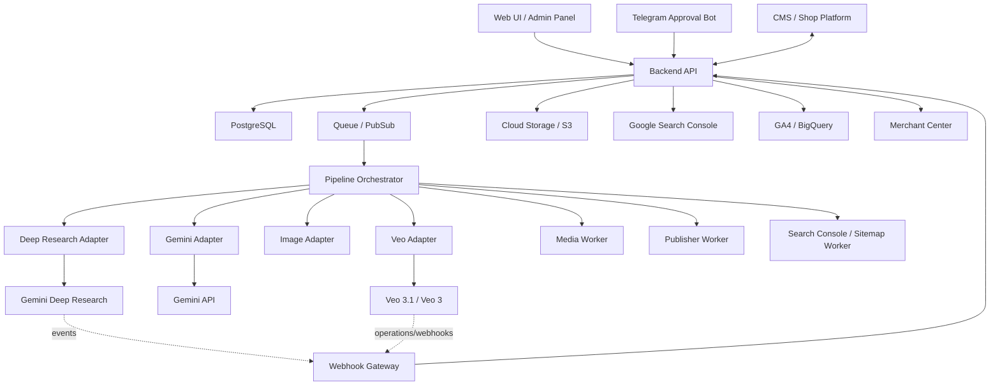
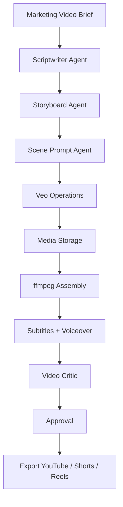
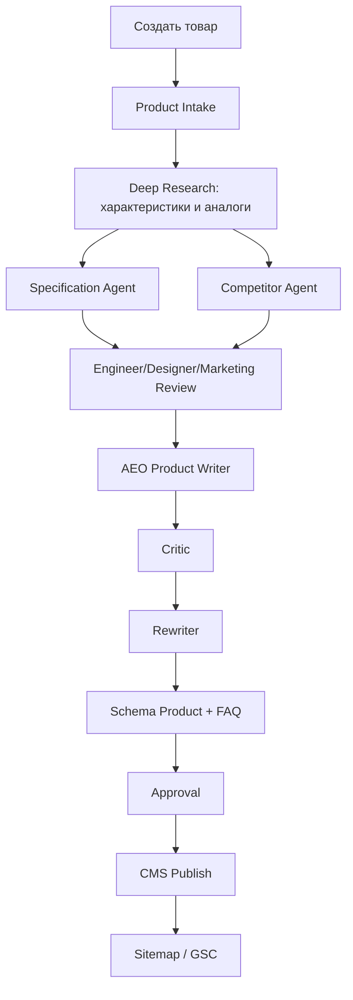
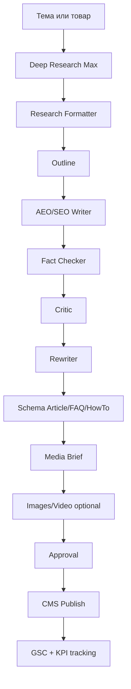
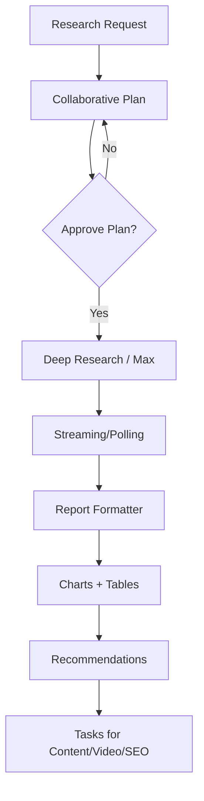
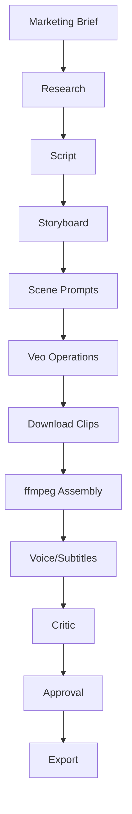
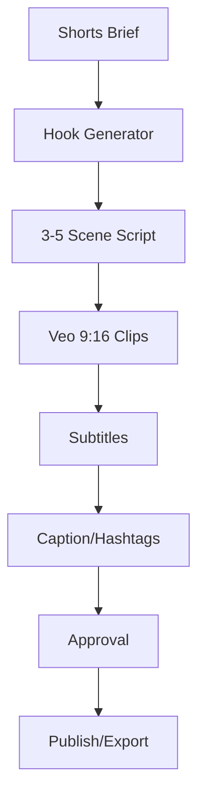
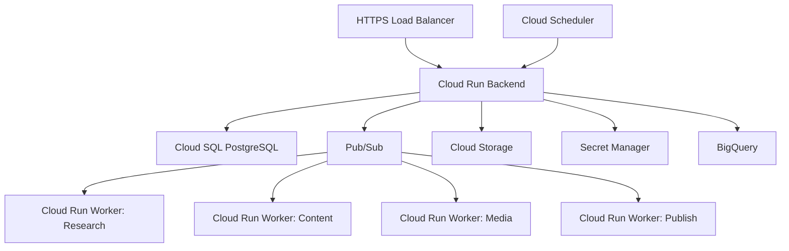

# Технологическое ТЗ и архитектура продукта

## 1. Название продукта

Рабочее название: **AI Marketing Content Factory для интернет-магазина электротоваров**.

Продукт представляет собой Google-first агентную платформу, которая проводит глубокие маркетинговые исследования, создает товарный и SEO/AEO-контент, генерирует изображения, длинные видео и shorts, отправляет материалы на апрув и публикует их в CMS интернет-магазина.

## 2. Цель технологического ТЗ

Документ описывает техническую архитектуру продукта для разработки MVP и дальнейшего масштабирования.

Цель:

- определить компоненты системы;
- выбрать основной технологический стек;
- описать роли агентов;
- описать data flow и event flow;
- описать интеграции Google Deep Research, Gemini API, Veo, webhooks, Search Console, Merchant Center, GA4;
- определить модель данных;
- определить API backend;
- определить очереди, статусы, retry и хранение результатов;
- зафиксировать безопасность, качество, мониторинг и этапы разработки.

## 3. Принципиальное архитектурное решение

Систему нужно строить как **Google-first event-driven агентную платформу**.

Главные причины:

- Deep Research закрывает самую дорогую часть работы: глубокое исследование рынка, конкурентов, отзывов, характеристик и AI Overviews;
- Gemini API закрывает текст, структурирование, vision-анализ и нормализацию данных;
- Veo 3.1 / Veo 3 закрывает генерацию видео и shorts;
- Gemini webhooks и long-running operations позволяют не держать процессы синхронно;
- Google Search Console, GA4 и Merchant Center дают прямой контур SEO, GEO и e-commerce аналитики.

Все Google-сервисы подключаются через адаптеры. Бизнес-логика не должна напрямую зависеть от SDK конкретного провайдера.

## 4. High-Level Architecture



## 5. Основные подсистемы

### 5.1. Web UI

Назначение:

- добавление товара;
- запуск pipeline;
- просмотр статуса;
- просмотр research reports;
- редактирование черновиков;
- апрув статьи, карточки, видео brief, медиа;
- управление публикациями;
- просмотр логов и ошибок.

Технологии:

- React;
- TypeScript;
- Vite;
- TanStack Query;
- Tailwind CSS / shadcn/ui;
- Monaco Editor или Markdown editor для редактирования статей.

Основные экраны:

- Dashboard;
- Products;
- Content Tasks;
- Research Reports;
- Article/Card Editor;
- Media Studio;
- Approval Queue;
- Publications;
- Integrations;
- Settings.

### 5.2. Backend API

Назначение:

- REST API для UI;
- управление задачами;
- оркестрация pipeline;
- авторизация;
- прием webhooks;
- интеграция с CMS;
- доступ к БД и storage.

Технологии:

- Python 3.12;
- FastAPI;
- Pydantic;
- SQLAlchemy;
- Alembic;
- Uvicorn / Gunicorn;
- PostgreSQL;
- Redis для локального MVP;
- Pub/Sub / Cloud Tasks для Google Cloud production.

### 5.3. Pipeline Orchestrator

Назначение:

- запуск многошаговых задач;
- управление состоянием;
- маршрутизация между агентами;
- retry;
- ожидание webhooks;
- продолжение после апрува;
- продолжение после long-running operation.

В MVP можно реализовать на Celery/RQ.

В production рекомендуется:

- Temporal.io, если нужен сложный workflow engine;
- или Google Cloud Pub/Sub + Cloud Tasks + PostgreSQL state machine.

### 5.4. Agent Workers

Каждый agent worker выполняет одну специализированную роль.

Базовые workers:

- Research Worker;
- Gemini Text Worker;
- Content Writer Worker;
- Critic/Rewriter Worker;
- Schema Worker;
- Image Worker;
- Video Worker;
- Media Assembly Worker;
- Approval Worker;
- Publisher Worker;
- Indexing Worker;
- Monitoring Worker.

### 5.5. Webhook Gateway

Назначение:

- принимать внешние события;
- проверять подпись;
- обеспечивать идемпотентность;
- связывать событие с pipeline task;
- продолжать pipeline.

Endpoints:

- `POST /webhooks/gemini`;
- `POST /webhooks/veo`;
- `POST /webhooks/telegram`;
- `POST /webhooks/cms`;
- `POST /webhooks/internal`.

Требования:

- проверка signature;
- проверка timestamp;
- защита от replay attacks;
- хранение webhook event;
- обработка повторов через `webhook_id`;
- быстрый ответ 2xx после постановки события в очередь.

## 6. Google-first стек

### 6.1. Deep Research

Назначение:

- маркетинговые исследования;
- конкурентный анализ;
- поиск характеристик;
- анализ отзывов;
- анализ YouTube/соцсетей;
- SEO/GEO исследования;
- AI Overviews аудит;
- подготовка research brief для контента.

Поддерживаемые agents:

- `deep-research-preview-04-2026`;
- `deep-research-max-preview-04-2026`.

Технические правила:

- запускать через Gemini Interactions API;
- использовать `background=true`;
- хранить `interaction_id`;
- получать результат через polling или streaming;
- при streaming хранить `last_event_id`;
- для сложных задач использовать `collaborative_planning=true`;
- для отчетов с графиками использовать `visualization="auto"`;
- итоговый отчет нормализовать отдельным Formatter Agent.

### 6.2. Gemini API

Назначение:

- генерация текстов;
- нормализация Deep Research reports в JSON;
- генерация карточек;
- генерация статей;
- критика и переписывание;
- анализ изображений;
- извлечение характеристик;
- генерация schema.org;
- генерация video brief и сценариев.

Принцип:

- Deep Research отвечает за сбор и синтез источников;
- Gemini text model отвечает за структурирование, writing и transformations;
- финальные данные проходят validation layer.

### 6.3. Veo 3.1 / Veo 3

Назначение:

- генерация коротких видео-сцен;
- генерация shorts;
- генерация сцен для длинного ролика;
- video extension;
- ролики по first/last frame;
- ролики по reference images.

Архитектурное правило:

Длинное видео не генерируется одним запросом. Длинное видео собирается из коротких сцен.

Pipeline:



### 6.4. Google Search Console

Назначение:

- анализ запросов;
- мониторинг CTR;
- поиск страниц с падением;
- проверка индексации;
- оценка эффективности обновлений.

Использование:

- входные данные для Topic Researcher Agent;
- KPI после публикации;
- monthly SEO/GEO audit.

### 6.5. GA4 / BigQuery

Назначение:

- поведение пользователей;
- конверсии;
- путь покупателя;
- эффективность карточек и статей;
- сравнение AI-generated контента со старым.

Использование:

- оценка ROI;
- контент-приоритизация;
- A/B тесты описаний;
- email и video performance.

### 6.6. Google Merchant Center

Назначение:

- GTIN/EAN;
- наличие;
- цены;
- товарный фид;
- совместимость с Google Shopping и AI commerce сценариями.

Требование:

Карточка товара должна учитывать поля Merchant Center: availability, price, brand, gtin, mpn, condition, shipping, returns.

## 7. Агентная архитектура

### 7.1. Основные агенты

| Агент | Назначение | Основная модель/сервис |
|------|------------|------------------------|
| Product Intake Agent | нормализация товара | Gemini |
| Deep Research Agent | глубокое исследование | Gemini Deep Research |
| Specification Agent | характеристики и источники | Gemini + Search |
| Competitor Agent | аналоги и конкуренты | Deep Research |
| Engineer Reviewer | инженерная оценка | Gemini |
| Designer Reviewer | UX и визуальная оценка | Gemini multimodal |
| Marketing Strategist | позиционирование и brief | Deep Research + Gemini |
| AEO/SEO Writer | карточка/статья | Gemini |
| Critic Agent | критика качества | Gemini |
| Rewriter Agent | улучшение текста | Gemini |
| Schema Agent | JSON-LD | Gemini + validator |
| Visual Agent | изображения/инфографика | Imagen/Nano Banana |
| Video Agent | сценарий и Veo pipeline | Gemini + Veo |
| Approval Agent | ручной апрув | Telegram/UI |
| Publisher Agent | публикация | CMS API |
| Indexing Agent | sitemap/GSC | GSC API |
| AI Tools Monitor | мониторинг новых AI tools | cron + Gemini |

### 7.2. Product Marketing Context

Все маркетинговые и контентные агенты должны читать:

- `.agents/product-marketing-context.md`.

Файл содержит:

- описание магазина;
- целевую аудиторию;
- категории;
- jobs to be done;
- боли покупателей;
- tone of voice;
- конкурентов;
- возражения;
- доказательства;
- правила коммуникации;
- цели конверсии.

### 7.3. Skills Registry

Система должна поддерживать registry skills.

Основной внешний источник:

- `https://github.com/Sevrikov/marketingskills`

Используемые skills:

- `ai-seo`;
- `schema-markup`;
- `programmatic-seo`;
- `copywriting`;
- `copy-editing`;
- `competitor-alternatives`;
- `content-strategy`;
- `analytics-tracking`;
- `image`;
- `video`.

Формат локального хранения:

```text
.agents/
├── product-marketing-context.md
├── marketingskills/
└── skills/
```

### 7.4. Agent Skills Matrix

Каждый агент должен иметь явно описанный набор skills. Skill — это не просто prompt, а повторяемый рабочий навык: когда применять, какие данные нужны, какие tools доступны, какой результат должен получиться и какие проверки обязательны.

Минимальная структура skill:

```yaml
name: ecommerce-aeo-product-writer
version: 1.0.0
owner: content
trigger:
  - generate product card
  - update product description
inputs:
  - product
  - specifications
  - research_report
  - product_marketing_context
tools:
  - gemini_text
  - rag_search
  - schema_validator
outputs:
  - content_version
  - meta_title
  - meta_description
  - faq
  - internal_links
quality_checks:
  - answer_block_check
  - source_check
  - aeo_check
  - schema_check
```

### 7.5. Обязательные skills по агентам

| Агент | Обязательные skills | Tools/API | Основной результат |
|------|---------------------|----------|--------------------|
| Product Intake Agent | `product-normalization`, `image-intake`, `merchant-fields-check` | CMS API, Merchant Center, Gemini Vision | нормализованный товар |
| Deep Research Agent | `market-research`, `competitor-research`, `source-synthesis`, `collaborative-planning` | Gemini Deep Research, File Search, web search | research report |
| Specification Agent | `spec-extraction`, `datasheet-reading`, `confidence-scoring`, `hypothesis-labeling` | Gemini, File Search, PDF parser | таблица характеристик |
| Competitor Agent | `competitor-profiling`, `competitor-alternatives`, `price-comparison` | Deep Research, search, competitor APIs | аналоги и сравнение |
| Engineer Reviewer | `engineering-review`, `risk-analysis`, `reliability-analysis` | Gemini, RAG specs | инженерная оценка |
| Designer Reviewer | `ux-review`, `visual-review`, `product-presentation-review` | Gemini Vision, image tools | дизайнерская оценка |
| Marketing Strategist | `positioning`, `offer-design`, `audience-fit`, `video-brief` | Deep Research, product context | marketing brief |
| AEO/SEO Writer | `ai-seo`, `copywriting`, `aeo-answer-blocks`, `programmatic-seo` | Gemini, skills registry | карточка/статья |
| Critic Agent | `copy-editing`, `fact-check`, `aeo-quality-review`, `thin-content-detection` | Gemini, validators | замечания |
| Rewriter Agent | `copy-editing`, `rewrite-for-aeo`, `rewrite-for-conversion` | Gemini | улучшенная версия |
| Schema Agent | `schema-markup`, `jsonld-generation`, `rich-results-validation` | Gemini, schema validator | JSON-LD |
| Visual Agent | `image-brief`, `infographic-planning`, `alt-text-generation` | Imagen/Nano Banana, storage | изображения/brief |
| Video Agent | `video`, `storyboard`, `scene-prompting`, `shorts-formatting` | Gemini, Veo, ffmpeg | видео/shorts assets |
| Approval Agent | `approval-routing`, `change-request-parsing`, `decision-logging` | Telegram, UI | решение апрува |
| Publisher Agent | `cms-publishing`, `markdown-to-html`, `internal-linking` | CMS API, storage | опубликованная страница |
| Indexing Agent | `seo-audit`, `sitemap-update`, `gsc-inspection`, `ai-visibility-check` | GSC, sitemap, GA4 | indexing report |
| AI Tools Monitor | `tool-discovery`, `github-repo-evaluation`, `relevance-scoring` | GitHub, RSS, Telegram, Gemini | база AI tools |

### 7.6. Кастомные ecommerce skills

Помимо skills из `marketingskills`, нужно создать локальные skills под интернет-магазин электротоваров.

Рекомендуемый список:

- `ecommerce-product-normalization`;
- `ecommerce-specification-extraction`;
- `ecommerce-engineer-review`;
- `ecommerce-price-quality-analysis`;
- `ecommerce-aeo-product-description`;
- `ecommerce-aeo-category-description`;
- `ecommerce-buying-guide`;
- `ecommerce-comparison-table`;
- `ecommerce-faq-from-reviews`;
- `ecommerce-merchant-center-check`;
- `ecommerce-video-brief`;
- `ecommerce-shorts-script`;
- `ecommerce-360-product-media`;
- `ecommerce-cms-publisher`;
- `ecommerce-google-indexing-flow`.

Каждый локальный skill хранится в:

```text
.agents/skills/{skill-name}/SKILL.md
```

### 7.7. Skill routing

Orchestrator должен выбирать skills по типу задачи.

Примеры маршрутизации:

| Входная задача | Skills |
|---------------|--------|
| "создать карточку товара" | `product-normalization`, `spec-extraction`, `ai-seo`, `copywriting`, `schema-markup` |
| "обновить статью под AI Overviews" | `ai-seo`, `copy-editing`, `schema-markup`, `seo-audit` |
| "сравнить товар с аналогами" | `competitor-alternatives`, `price-quality-analysis`, `comparison-table` |
| "сделать шортс" | `video`, `shorts-script`, `scene-prompting`, `caption-writing` |
| "сделать длинное видео" | `video-brief`, `storyboard`, `scene-prompting`, `ffmpeg-assembly` |
| "проверить индексацию" | `seo-audit`, `gsc-inspection`, `ai-visibility-check` |
| "найти новые AI репозитории" | `tool-discovery`, `github-repo-evaluation`, `relevance-scoring` |

### 7.8. Skill lifecycle

Skills должны версионироваться и проходить жизненный цикл:

```text
draft -> testing -> active -> deprecated -> archived
```

Для каждого skill нужно хранить:

- версию;
- автора;
- дату обновления;
- changelog;
- примеры входов;
- примеры хороших выходов;
- validation checklist;
- связанные skills;
- стоимость выполнения;
- known failure modes.

### 7.9. Skill quality gates

Ни один agent output не должен идти дальше без проверки skill quality gates.

Примеры:

- Research skill: есть минимум N источников или явно указано, что данных мало.
- Specification skill: каждая характеристика имеет source/confidence/is_hypothesis.
- AEO writing skill: каждый ключевой абзац является самостоятельным answer-блоком.
- Schema skill: JSON-LD валиден и соответствует видимому контенту.
- Video skill: каждая сцена связана с brief, а не является случайной визуализацией.
- Publishing skill: есть approval record.
- Indexing skill: sitemap обновлен, URL сохранен, результат проверки залогирован.

### 7.10. A2A-ready agent architecture

Система должна быть готова к будущей поддержке Agent-to-Agent (A2A), но MVP не обязан реализовывать полноценный A2A protocol.

A2A нужен не для локального вызова одного агента другим, а для enterprise-сценариев:

- агент находится в другом сервисе;
- агент принадлежит другой команде;
- агент написан на другом языке;
- агент работает в другом framework;
- агент предоставлен внешним поставщиком;
- агент должен быть обнаружен через registry/catalog.

Для MVP используется simpler pattern:

```text
Local Orchestrator -> Local Agent -> Skill -> Adapter
```

Для enterprise-фазы целевой pattern:

```text
Local Orchestrator -> A2A Client -> Remote Agent Card -> Remote Agent Endpoint
```

Требования, которые нужно заложить уже сейчас:

- каждый агент имеет name, description, version, owner;
- каждый агент имеет capabilities;
- каждый агент имеет allowed tools;
- каждый агент имеет risky actions policy;
- каждый агент имеет audit log;
- каждый агент может быть private или public;
- формат metadata должен позволять позже сгенерировать Agent Card;
- внешние agents могут подключаться только через allowlist, auth и scoped permissions.

Не делать в MVP:

- не открывать `/a2a/*` endpoints наружу;
- не подключать неизвестных remote agents;
- не давать external agents доступ к CMS, ценам, заказам, клиентским данным или публикации;
- не заменять внутренний task engine A2A-вызовами.

План внедрения:

| Фаза | Что делаем |
|------|------------|
| MVP | локальные agents + skills registry |
| Phase 2 | internal agent cards в БД |
| Phase 3 | A2A-compatible endpoints для selected agents |
| Enterprise | A2A registry, auth, policy engine, audit, tenant isolation |

## 8. Основные pipeline

### 8.1. Pipeline: карточка товара



### 8.2. Pipeline: SEO/AEO статья



### 8.3. Pipeline: marketing deep research



### 8.4. Pipeline: длинное видео



### 8.5. Pipeline: shorts



## 9. State Machine

Основные статусы `content_tasks`:

```text
draft
queued
research_planning
waiting_research_plan_approval
research_running
research_completed
content_generating
fact_checking
criticizing
rewriting
schema_generating
media_planning
media_running
waiting_approval
approved
publishing
published
indexing_requested
done
failed
cancelled
```

Статусы long-running operation:

```text
created
submitted
running
waiting_webhook
polling
completed
downloaded
failed
expired
cancelled
```

## 10. Модель данных

### 10.1. Основные таблицы

```sql
CREATE TABLE products (
    id UUID PRIMARY KEY,
    title TEXT NOT NULL,
    brand TEXT,
    model TEXT,
    category TEXT,
    sku TEXT,
    gtin TEXT,
    mpn TEXT,
    price NUMERIC,
    currency TEXT,
    availability TEXT,
    cms_product_id TEXT,
    source_url TEXT,
    created_at TIMESTAMP NOT NULL,
    updated_at TIMESTAMP NOT NULL
);

CREATE TABLE content_tasks (
    id UUID PRIMARY KEY,
    product_id UUID REFERENCES products(id),
    task_type TEXT NOT NULL,
    language TEXT NOT NULL,
    status TEXT NOT NULL,
    current_step TEXT,
    priority INTEGER DEFAULT 5,
    created_by TEXT,
    error_message TEXT,
    created_at TIMESTAMP NOT NULL,
    updated_at TIMESTAMP NOT NULL
);

CREATE TABLE research_reports (
    id UUID PRIMARY KEY,
    task_id UUID REFERENCES content_tasks(id),
    mode TEXT NOT NULL,
    agent_id TEXT,
    interaction_id TEXT,
    prompt TEXT NOT NULL,
    plan_markdown TEXT,
    report_markdown TEXT,
    normalized_json JSONB,
    sources JSONB,
    cost_estimate NUMERIC,
    status TEXT NOT NULL,
    created_at TIMESTAMP NOT NULL,
    completed_at TIMESTAMP
);

CREATE TABLE content_versions (
    id UUID PRIMARY KEY,
    task_id UUID REFERENCES content_tasks(id),
    version_type TEXT NOT NULL,
    title TEXT,
    body_markdown TEXT,
    body_html TEXT,
    meta_title TEXT,
    meta_description TEXT,
    schema_json JSONB,
    quality_score INTEGER,
    created_at TIMESTAMP NOT NULL
);

CREATE TABLE media_assets (
    id UUID PRIMARY KEY,
    task_id UUID REFERENCES content_tasks(id),
    asset_type TEXT NOT NULL,
    status TEXT NOT NULL,
    file_url TEXT,
    source_prompt TEXT,
    provider TEXT,
    external_operation_id TEXT,
    width INTEGER,
    height INTEGER,
    duration_seconds NUMERIC,
    alt_text TEXT,
    caption TEXT,
    metadata JSONB,
    created_at TIMESTAMP NOT NULL,
    updated_at TIMESTAMP NOT NULL
);

CREATE TABLE webhook_events (
    id UUID PRIMARY KEY,
    provider TEXT NOT NULL,
    event_type TEXT NOT NULL,
    webhook_id TEXT,
    signature_valid BOOLEAN,
    related_task_id UUID,
    payload JSONB NOT NULL,
    received_at TIMESTAMP NOT NULL,
    processed_at TIMESTAMP,
    processing_status TEXT NOT NULL
);

CREATE TABLE skill_registry (
    id UUID PRIMARY KEY,
    name TEXT NOT NULL,
    version TEXT NOT NULL,
    status TEXT NOT NULL,
    owner TEXT,
    trigger_phrases JSONB,
    input_schema JSONB,
    output_schema JSONB,
    allowed_tools JSONB,
    quality_checks JSONB,
    related_skills JSONB,
    skill_path TEXT,
    changelog TEXT,
    created_at TIMESTAMP NOT NULL,
    updated_at TIMESTAMP NOT NULL,
    UNIQUE(name, version)
);

CREATE TABLE agent_skill_bindings (
    id UUID PRIMARY KEY,
    agent_name TEXT NOT NULL,
    skill_id UUID REFERENCES skill_registry(id),
    is_required BOOLEAN DEFAULT true,
    priority INTEGER DEFAULT 5,
    created_at TIMESTAMP NOT NULL
);

CREATE TABLE agent_registry (
    id UUID PRIMARY KEY,
    name TEXT NOT NULL,
    description TEXT,
    version TEXT NOT NULL,
    owner TEXT,
    visibility TEXT NOT NULL DEFAULT 'private',
    runtime_type TEXT NOT NULL DEFAULT 'local',
    endpoint_url TEXT,
    capabilities JSONB,
    allowed_tools JSONB,
    risky_actions JSONB,
    auth_policy JSONB,
    agent_card JSONB,
    status TEXT NOT NULL DEFAULT 'active',
    created_at TIMESTAMP NOT NULL,
    updated_at TIMESTAMP NOT NULL,
    UNIQUE(name, version)
);
```

### 10.2. Дополнительные таблицы

Нужны во второй фазе:

- `specification_items`;
- `competitor_items`;
- `approval_requests`;
- `publication_records`;
- `ai_tools`;
- `prompt_templates`;
- `skill_registry`;
- `agent_skill_bindings`;
- `agent_registry`;
- `video_scenes`;
- `quality_checks`;
- `cost_events`.

## 11. Backend API

### 11.1. Products

- `POST /api/products`;
- `GET /api/products`;
- `GET /api/products/{id}`;
- `PATCH /api/products/{id}`;
- `POST /api/products/{id}/images`;

### 11.2. Tasks

- `POST /api/tasks`;
- `GET /api/tasks`;
- `GET /api/tasks/{id}`;
- `POST /api/tasks/{id}/start`;
- `POST /api/tasks/{id}/cancel`;
- `POST /api/tasks/{id}/retry`;
- `GET /api/tasks/{id}/events`;

### 11.3. Research

- `POST /api/research`;
- `POST /api/research/{id}/approve-plan`;
- `GET /api/research/{id}`;
- `GET /api/research/{id}/report`;
- `POST /api/research/{id}/normalize`;

### 11.4. Content

- `GET /api/tasks/{id}/versions`;
- `POST /api/tasks/{id}/generate-outline`;
- `POST /api/tasks/{id}/generate-content`;
- `POST /api/tasks/{id}/criticize`;
- `POST /api/tasks/{id}/rewrite`;
- `POST /api/tasks/{id}/generate-schema`;

### 11.5. Media

- `POST /api/tasks/{id}/media/brief`;
- `POST /api/tasks/{id}/media/images`;
- `POST /api/tasks/{id}/media/video`;
- `POST /api/tasks/{id}/media/shorts`;
- `GET /api/media/{id}`;
- `POST /api/media/{id}/approve`;

### 11.6. Approval

- `POST /api/approval/{task_id}/approve`;
- `POST /api/approval/{task_id}/request-changes`;
- `POST /api/approval/{task_id}/reject`;

### 11.7. Publication

- `POST /api/tasks/{id}/publish`;
- `GET /api/tasks/{id}/publication`;
- `POST /api/tasks/{id}/request-indexing`;

### 11.8. Webhooks

- `POST /webhooks/gemini`;
- `POST /webhooks/veo`;
- `POST /webhooks/telegram`;
- `POST /webhooks/cms`;

## 12. Prompt и template registry

Все prompts должны храниться как версии.

Минимальные поля prompt template:

- id;
- name;
- version;
- task_type;
- provider;
- model;
- system_prompt;
- user_template;
- expected_output;
- validation_schema;
- cost_class;
- owner;
- created_at;
- deprecated_at.

Prompt registry нужен для:

- контроля качества;
- повторяемости;
- A/B тестирования;
- отката к прошлой версии;
- оценки стоимости.

## 13. Качество и validation layer

Перед апрувом система запускает quality checks.

Проверки текста:

- первый абзац отвечает на вопрос;
- каждый важный абзац является самостоятельным answer-блоком;
- есть конкретные цифры или объяснение, почему цифр нет;
- источники указаны для важных фактов;
- гипотезы отделены от фактов;
- нет запрещенных рекламных общих фраз;
- есть H1/H2/H3;
- есть FAQ;
- есть internal links;
- есть meta title и meta description.

Проверки schema:

- JSON валиден;
- schema соответствует видимому контенту;
- Product содержит price, availability, brand, sku/gtin/mpn если есть;
- FAQPage содержит реальные вопросы;
- Article содержит author/dateModified.

Проверки видео:

- длительность соответствует brief;
- формат соответствует платформе;
- есть hook;
- есть CTA;
- нет неподтвержденных утверждений;
- есть субтитры;
- есть title/description/caption.

## 14. Безопасность

Требования:

- все секреты в Secret Manager или `.env` только локально;
- не логировать API keys;
- RBAC для ролей admin/editor/viewer;
- audit log для публикаций и изменений цены;
- webhook signature verification;
- replay protection;
- rate limiting;
- allowlist IP для внутренних webhooks, если возможно;
- отдельные сервисные аккаунты Google с минимальными правами;
- шифрование файлов в storage;
- резервное копирование БД.

Особо рискованные операции требуют ручного approval:

- публикация на боевой сайт;
- изменение цены;
- массовое обновление карточек;
- рассылка email;
- публикация видео;
- отправка в Merchant Center.

## 15. Стоимость и бюджет

Система должна вести учет стоимости:

- Deep Research calls;
- Gemini token usage;
- Veo operations;
- image generation;
- storage;
- Cloud Run execution;
- BigQuery queries.

Нужны budget alerts:

- дневной лимит;
- недельный лимит;
- месячный лимит;
- лимит на один task;
- лимит на один video pipeline.

Правила экономии:

- Standard Research для ежедневных задач;
- Max Research только для стратегических задач;
- кешировать похожие исследования;
- использовать короткие specific prompts;
- не запускать Veo до approval brief;
- сначала генерировать low-cost storyboard и только потом видео.

## 16. Мониторинг и логи

Логировать:

- task transitions;
- prompt version;
- model;
- cost estimate;
- external operation id;
- webhook ids;
- errors;
- retries;
- publication events;
- approval decisions.

Метрики:

- время генерации карточки;
- время генерации статьи;
- время research;
- стоимость task;
- процент failed tasks;
- процент задач, отправленных на доработку;
- органический трафик после публикации;
- AI Overview visibility;
- CTR карточек;
- email open/click rate;
- video views/retention.

## 17. Deployment

### 17.1. MVP локально

```yaml
services:
  backend:
    image: ai-content-backend
  worker:
    image: ai-content-worker
  postgres:
    image: postgres:16
  redis:
    image: redis:7
  minio:
    image: minio/minio
```

### 17.2. Production Google Cloud



## 18. MVP Scope

MVP должен включать:

- backend API;
- PostgreSQL;
- очередь;
- простой UI;
- товар;
- запуск research task;
- Deep Research adapter;
- Gemini text adapter;
- генерация карточки/статьи;
- критика и переписывание;
- schema generation;
- approval через UI или Telegram;
- экспорт Markdown/HTML;
- базовый CMS publish или сохранение publish package;
- GSC/sitemap task;
- базовый video brief без полной генерации видео.
- `agent_registry` как A2A-ready metadata layer без публичных A2A endpoints.

Необязательно для MVP:

- полноценный Veo production pipeline;
- автоматический post в YouTube/TikTok;
- полный Merchant Center sync;
- BigQuery dashboards;
- Temporal;
- multi-tenant architecture.
- полноценная A2A protocol реализация;
- внешний marketplace/registry агентов.

## 19. Roadmap

### Фаза 1. Технический фундамент

- FastAPI backend;
- PostgreSQL schema;
- task state machine;
- queue;
- storage;
- auth;
- базовый UI.

### Фаза 2. Research и контент

- Deep Research adapter;
- Gemini adapter;
- research reports;
- карточка товара;
- SEO/AEO статья;
- criticism/rewrite;
- schema generation.

### Фаза 3. Approval и публикация

- Telegram approval;
- CMS adapter;
- publication records;
- sitemap update;
- Search Console integration.

### Фаза 4. Media

- image generation;
- media storage;
- video brief;
- storyboard;
- Veo scene generation;
- ffmpeg assembly;
- subtitles.

### Фаза 5. GEO и маркетинг

- AI Overviews audit;
- programmatic SEO;
- email plan generation;
- YouTube/Telegram content plan;
- Merchant Center data checks.

### Фаза 6. Масштабирование

- Temporal или Cloud-native orchestration;
- BigQuery KPI dashboards;
- A/B testing;
- skill registry;
- AI tools monitor;
- cost optimizer.

### Фаза 7. Enterprise A2A interoperability

- internal Agent Cards для всех production agents;
- A2A-compatible endpoints для selected read-only agents;
- A2A client для trusted remote agents;
- enterprise agent registry/catalog;
- auth и scoped permissions для remote agents;
- policy engine для risky actions;
- audit trail для всех A2A-вызовов;
- tenant isolation, если появится multi-tenant deployment;
- security review перед подключением внешних agents;
- интеграция с Microsoft Agent Framework / Azure AI Foundry как отдельный optional track.

## 20. Критерии готовности архитектуры

Архитектура считается готовой к разработке, если:

- определен основной Google-first стек;
- есть state machine задач;
- есть список agents;
- есть sequence/pipeline diagrams;
- есть модель данных;
- есть API endpoints;
- определены webhooks и long-running operations;
- определены правила approval;
- определены quality checks;
- определена стратегия deployment;
- определен MVP scope;
- определен roadmap.
- определено, что A2A не входит в MVP runtime, но есть `agent_registry` и A2A-ready metadata;
- определены risky actions и approval policy для будущих local/remote agents.

## 21. Технические источники

- Gemini Deep Research Agent: https://ai.google.dev/gemini-api/docs/deep-research
- Gemini API webhooks: https://ai.google.dev/gemini-api/docs/webhooks
- Gemini API video generation / Veo: https://ai.google.dev/gemini-api/docs/video
- Gemini API reference: https://ai.google.dev/api
- Google Search Console API: https://developers.google.com/webmaster-tools
- Google Analytics Data API: https://developers.google.com/analytics/devguides/reporting/data/v1
- Google Merchant Center: https://developers.google.com/shopping-content
- Marketing skills repository: https://github.com/Sevrikov/marketingskills
- Microsoft Agent Framework Agent-to-Agent journey: https://learn.microsoft.com/en-us/agent-framework/journey/agent-to-agent
- Microsoft Agent Framework A2A Agent provider: https://learn.microsoft.com/en-us/agent-framework/agents/providers/agent-to-agent
- Microsoft Agent Framework A2A Integration: https://learn.microsoft.com/en-us/agent-framework/integrations/a2a
