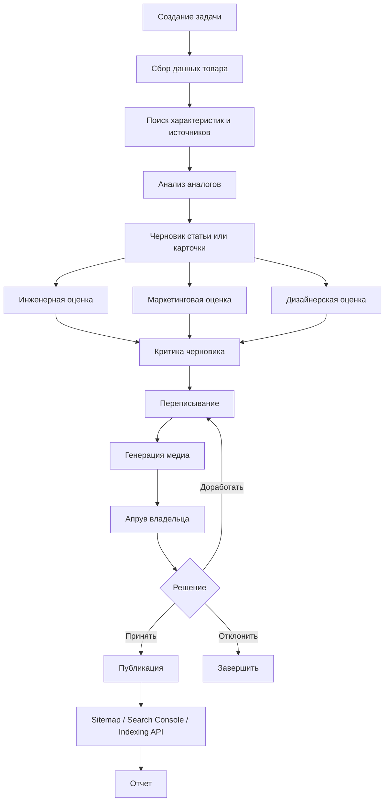
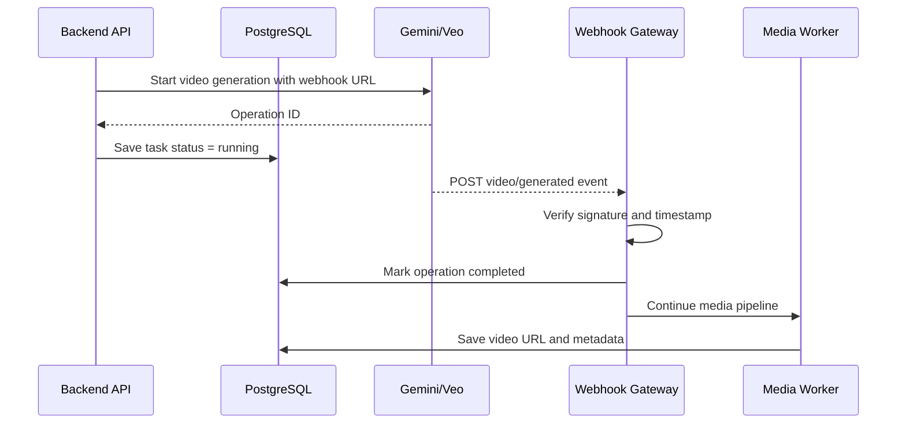
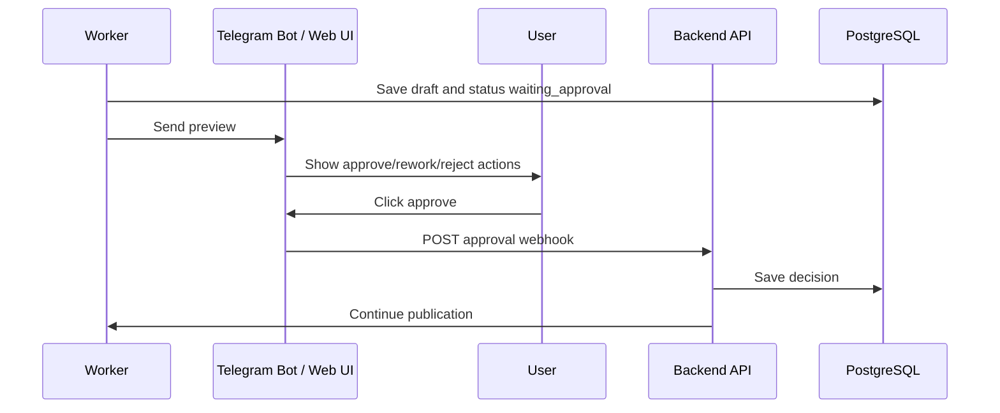

# Техническое задание: AI-агент для автоматизации контента интернет-магазина

## 1. Назначение проекта

Разработать систему для автоматизации создания, проверки, улучшения и публикации контента интернет-магазина с использованием Gemini API и сопутствующих сервисов.

Система должна помогать владельцу небольшого интернет-магазина с ограниченными ресурсами быстро создавать качественные карточки товаров, SEO-статьи, медиа-материалы, сравнительные блоки, инженерные и маркетинговые оценки, а затем отправлять результат на ручной апрув и публиковать на сайте.

Ключевая идея: вебхуки не повышают позиции сайта в Google напрямую. Они используются как технический механизм для продолжения долгих фоновых процессов: генерации видео, batch-задач, ожидания апрува, публикации и последующего запроса на переиндексацию.

## 2. Бизнес-цель

Сократить ручную работу по подготовке товарного и информационного контента для интернет-магазина.

Ожидаемый эффект:

- быстрее создавать карточки товаров;
- быстрее выпускать SEO-статьи под товары и пользовательские вопросы;
- повышать качество текстов за счет аналитики, критики и переписывания;
- добавлять в статьи полезные медиа: изображения, видео, shorts, анимации товара;
- ускорять переиндексацию новых и обновленных страниц через Google API;
- держать владельца магазина в контуре принятия решений через ручной апрув.

## 3. Контекст из чата

В обсуждении были выделены следующие потребности:

- магазин небольшой, работает один человек или маленькая команда;
- главная боль: контент и карточки товаров;
- требуется автоматизация не только текста, но и аналитики;
- нужен поиск аналогов и конкурентов;
- нужны технические характеристики, даже если их нет в исходных данных;
- нужна инженерная оценка товара;
- нужна оценка со стороны дизайнера и маркетолога;
- нужны изображения, видео, shorts и анимированный обзор товара;
- нужен черновик статьи, критика статьи, переписывание и финальная версия;
- нужен ручной апрув перед публикацией;
- нужна публикация статьи на сайте;
- нужна связь с Google Search Console / Indexing API для ускорения переиндексации;
- нужно понять, где в этом процессе применяются вебхуки.

## 4. Основные пользователи

### 4.1. Владелец магазина

Основной пользователь системы. Загружает товар, фото, базовые данные и получает готовый контент.

Задачи:

- добавить новый товар;
- запустить генерацию карточки или статьи;
- посмотреть черновик;
- принять, отклонить или отправить на доработку;
- опубликовать материал;
- отслеживать статус генерации.

### 4.2. Контент-менеджер

Опциональная роль для будущего расширения.

Задачи:

- редактировать черновики;
- проверять SEO-блоки;
- управлять очередью публикаций;
- работать с несколькими товарами одновременно.

### 4.3. Администратор

Настраивает интеграции.

Задачи:

- подключить Gemini API;
- подключить CMS / сайт;
- подключить Google Search Console или Indexing API;
- подключить Telegram-бота или email для апрува;
- настроить ключи, лимиты, webhooks, очереди и хранилище файлов.

## 5. Объем MVP

MVP должен покрывать один полный сценарий:

1. Пользователь добавляет товар.
2. Система собирает исходные данные.
3. Система ищет характеристики, аналоги и источники.
4. Система генерирует черновик карточки товара или статьи.
5. Система добавляет инженерную, дизайнерскую и маркетинговую оценку.
6. Система генерирует изображения или подбирает план медиа.
7. Система критикует черновик.
8. Система переписывает текст с учетом критики.
9. Система отправляет результат владельцу на апрув.
10. После апрува система публикует материал.
11. После публикации система отправляет URL на переиндексацию.

Видео, shorts и 360-анимацию можно реализовать во второй фазе, но архитектура MVP должна быть готова к этим задачам.

## 6. Функциональные требования

### 6.1. Импорт товара

Система должна принимать:

- название товара;
- категорию;
- бренд;
- модель;
- цену;
- краткое описание;
- фото товара;
- ссылку на страницу производителя, если есть;
- ссылку на текущую страницу товара, если товар уже опубликован;
- язык контента: русский, украинский или оба;
- целевой тип результата: карточка товара, SEO-статья, обзор, сравнение, инструкция.

Если часть данных отсутствует, система должна помечать их как неизвестные и пытаться найти через поиск.

### 6.2. Поиск характеристик

Система должна искать технические характеристики товара в открытых источниках:

- сайт производителя;
- PDF-инструкции;
- datasheet;
- интернет-магазины;
- обзоры;
- форумы;
- страницы конкурентов;
- маркетплейсы.

Результат поиска должен сохраняться как структурированный объект:

- характеристика;
- значение;
- единица измерения;
- источник;
- уровень доверия;
- комментарий.

Если характеристика не найдена, система должна:

- явно пометить ее как не найденную;
- предложить осторожную инженерную гипотезу;
- не выдавать гипотезу за факт.

### 6.3. Анализ аналогов и конкурентов

Система должна находить 3-7 аналогов товара.

Для каждого аналога нужно собрать:

- название;
- бренд;
- цена;
- ключевые характеристики;
- преимущества;
- недостатки;
- ссылка на источник;
- целевая аудитория;
- чем отличается от основного товара.

Результат должен использоваться в статье или карточке как сравнительная таблица.

### 6.4. Инженерная оценка

Система должна формировать отдельный блок оценки товара с позиции инженера.

Оцениваются:

- конструкция;
- надежность;
- материалы;
- разъемы;
- питание;
- тепловые режимы;
- ремонтопригодность;
- защита от влаги и пыли, если применимо;
- риски эксплуатации;
- типичные слабые места.

Формат результата:

- краткий вывод;
- 3-7 сильных сторон;
- 3-7 слабых сторон или рисков;
- рекомендации покупателю;
- уровень уверенности.

### 6.5. Дизайнерская оценка

Система должна оценивать товар с позиции дизайнера и пользовательского опыта.

Оцениваются:

- внешний вид;
- компактность;
- удобство установки;
- понятность интерфейсов;
- эргономика;
- качество визуальной подачи;
- пригодность для фото, видео и карточки товара.

### 6.6. Маркетинговая оценка

Система должна оценивать товар с позиции маркетолога.

Оцениваются:

- целевая аудитория;
- сценарии использования;
- позиционирование;
- цена / качество;
- аргументы для покупки;
- возражения покупателя;
- отличие от аналогов;
- какие ключевые запросы можно использовать в SEO.

### 6.7. Генерация карточки товара

Система должна генерировать:

- SEO title;
- meta description;
- H1;
- короткое описание;
- полное описание;
- список преимуществ;
- технические характеристики;
- FAQ;
- блок "кому подойдет";
- блок "на что обратить внимание";
- alt-тексты для изображений;
- микроразметку, если сайт поддерживает ее.

Текст должен быть полезным, конкретным и не выглядеть как общий AI-текст.

### 6.8. Генерация SEO-статьи

Система должна генерировать статью по теме товара или пользовательскому вопросу.

Структура статьи:

- SEO title;
- meta description;
- H1;
- лид;
- содержание;
- основные разделы H2/H3;
- практические инструкции;
- сравнительные таблицы;
- инженерные комментарии;
- маркетинговые выводы;
- FAQ;
- вывод;
- внутренние ссылки на товары;
- блок с рекомендованными товарами.

Для статьи нужно хранить:

- тему;
- целевые ключевые запросы;
- интент пользователя;
- источники;
- черновики;
- замечания критика;
- финальную версию;
- дату публикации;
- URL опубликованной страницы.

### 6.9. Критика и переписывание

После генерации черновика система должна запускать отдельный этап критики.

Критик должен проверять:

- полноту ответа;
- фактическую точность;
- слабые места;
- SEO-структуру;
- естественность языка;
- коммерческую пользу;
- наличие воды;
- наличие неподтвержденных утверждений;
- качество заголовков;
- достаточность сравнений;
- наличие внутренних ссылок.

После критики система должна создать улучшенную версию текста.

### 6.10. Медиа-материалы

Система должна поддерживать несколько типов медиа.

#### 6.10.1. Изображения

Система должна уметь:

- генерировать иллюстрации к статье;
- создавать баннеры;
- создавать инфографику;
- формировать alt-тексты;
- подбирать места вставки изображений в статье.

Для генерации использовать доступные модели Google для изображений, например Imagen, если они доступны в выбранном аккаунте и регионе.

#### 6.10.2. Видео

Система должна уметь:

- писать сценарий видео по статье;
- разбивать сценарий на сцены;
- формировать prompt для генерации каждого клипа;
- запускать генерацию видео через доступные видео-модели Google, например Veo;
- получать результат через webhook;
- сохранять видео в хранилище;
- вставлять видео в статью или карточку.

#### 6.10.3. Shorts / Reels / TikTok

Система должна уметь создавать вертикальные короткие видео из основного сценария.

Требования:

- формат 9:16;
- длительность 15-60 секунд;
- структура: hook, 3-5 смысловых сцен, CTA;
- субтитры;
- вертикальный кроп;
- отдельное название и описание для соцсетей.

Склейку, кроп и субтитры выполнять через ffmpeg.

#### 6.10.4. Анимированный обзор товара 360

Система должна поддерживать два режима:

1. Реальные фото товара с 8-12 ракурсов.
2. 3D-модель товара, если она доступна.

Для режима с фото:

- принять серию изображений;
- выровнять порядок кадров;
- собрать GIF или WebP-анимацию через ffmpeg;
- создать подписи и alt-текст;
- вставить в карточку товара.

Для режима с 3D-моделью:

- принять модель;
- запустить render через Blender Python API;
- собрать вращение камеры вокруг товара;
- экспортировать WebP, MP4 или GIF.

Важно: для реального товара предпочтительнее реальные фото. Генеративные изображения нельзя использовать как фактическое изображение товара без пометки.

### 6.11. Ручной апрув

Перед публикацией система должна отправлять результат владельцу.

Каналы:

- Telegram-бот;
- email;
- веб-интерфейс.

Пользователь должен иметь действия:

- принять;
- отклонить;
- отправить на доработку;
- оставить комментарий;
- изменить заголовок;
- изменить цену или ссылку;
- выбрать дату публикации.

После апрува система должна продолжить pipeline автоматически.

### 6.12. Публикация

Система должна публиковать контент на сайте через доступный API.

Для MVP можно поддержать один из вариантов:

- Prom.ua / Хорошоп / OpenCart / WordPress / собственная CMS;
- публикация через REST API;
- публикация через админ-панель только как временный fallback.

После публикации система должна сохранить:

- URL;
- CMS ID;
- дату публикации;
- статус;
- версию текста;
- список медиа.

### 6.13. Переиндексация

После публикации или обновления страницы система должна отправить сигнал в Google.

Возможные механизмы:

- Google Search Console URL Inspection API для проверки статуса;
- Google Indexing API, если тип страниц и политика Google позволяют использовать его;
- отправка sitemap и обновление lastmod;
- внутренняя перелинковка.

Важно: Indexing API официально ограничен определенными типами страниц. Для обычных статей может потребоваться использовать sitemap, Search Console и внутренние ссылки вместо прямого Indexing API.

### 6.14. Deep Research для сложных исследований

Система должна поддерживать отдельный исследовательский режим на базе Gemini Deep Research Agent.

Deep Research не заменяет обычные быстрые вызовы Gemini. Его нужно использовать только там, где требуется многошаговое исследование: поиск, чтение источников, сравнение, синтез отчета и цитирование.

Поддерживаемые режимы:

| Режим | Agent ID | Назначение |
|------|----------|------------|
| Deep Research | `deep-research-preview-04-2026` | быстрые исследования, мониторинг, интерактивные отчеты |
| Deep Research Max | `deep-research-max-preview-04-2026` | глубокие исследования, конкурентный ландшафт, стратегические отчеты |

Обязательные технические правила:

- использовать только через Gemini Interactions API;
- запускать с `background=true`;
- хранить `interaction_id`;
- получать результат через polling или streaming;
- для streaming хранить `last_event_id` для восстановления после разрыва;
- для сложных задач включать `collaborative_planning=true`;
- для визуальных отчетов включать `visualization="auto"` и явно просить графики;
- для приватных документов использовать `file_search`;
- для доступа к внешним инструментам использовать `mcp_server`, если конкретная интеграция поддерживается;
- не требовать строгий structured output напрямую от Deep Research, так как его нужно нормализовать отдельным Formatter Agent.

Рекомендуемые сценарии:

- конкурентный анализ цен;
- анализ новых товаров перед закупкой;
- поиск технических характеристик и документации;
- еженедельный отчет по рынку;
- SEO/GEO-аудит ниши;
- исследование AI Overviews по ключевым запросам;
- контент-план на месяц;
- email-план на месяц;
- анализ YouTube/соцсетей конкурентов;
- подготовка аналитической базы для большой статьи.

### 6.15. Схемы использования Deep Research A-H

Система должна поддерживать реестр исследовательских схем.

| Схема | Название | Режим | Частота | Результат |
|------|----------|-------|---------|-----------|
| A | Мониторинг конкурентов | Deep Research | ежедневно/еженедельно | цены, отличия, алерты |
| B | Описание товаров | Deep Research Max | при добавлении SKU | research brief для карточки |
| C | Трендвотчинг и закупки | Deep Research Max | еженедельно | тренды, спрос, рекомендации |
| D | FAQ поддержки | Deep Research | при запуске категории | вопросы, ответы, скрипты |
| E | SEO-стратегия | Deep Research Max | ежеквартально | семантика, контент-план |
| F | Email-маркетинг | Deep Research | ежемесячно | 30-дневный email-план |
| G | Контент-план соцсетей | Deep Research Max | ежемесячно | YouTube/Telegram/blog идеи |
| H | AI Overviews / GEO | Deep Research Max | ежемесячно | аудит AI-видимости |

Для каждой схемы нужно хранить:

- prompt template;
- режим;
- частоту запуска;
- ответственного;
- бюджетный лимит;
- требования к источникам;
- формат результата;
- downstream agents, которые используют отчет.

### 6.16. Email-маркетинг

Система должна генерировать месячный email-план для интернет-магазина.

Входные данные:

- категории товаров;
- сезонность;
- акции;
- новые товары;
- сегменты клиентов;
- история продаж;
- конкуренты;
- календарь праздников.

Выход:

- 30-дневный план писем;
- тип письма;
- subject line;
- preview text;
- ключевые тезисы;
- товарная привязка;
- CTA;
- сегмент аудитории;
- ожидаемая цель: открытие, клик, повторная покупка, возврат в корзину.

Интеграции:

- eSputnik;
- SendPulse;
- Mailchimp;
- Telegram/email approval перед запуском рассылки.

### 6.17. Контент-план YouTube, Telegram и соцсетей

Система должна формировать контент-план на основе анализа конкурентов и трендов.

Требования:

- анализировать топовые видео и посты в нише;
- разделять evergreen и актуальный контент;
- искать темы, которые конкуренты не закрыли;
- привязывать каждую идею к товару или категории;
- формировать hook, тезисы, формат и CTA;
- выделять идеи с высоким вирусным потенциалом;
- отдавать сценарии дальше в Video Agent и Social Content Agent.

Выход:

- 20 идей для YouTube;
- 30 идей для Telegram/соцсетей;
- 5 идей с вирусным потенциалом;
- список товаров, которые нужно связать с каждым контентом;
- рекомендации по формату: обзор, сравнение, инструкция, распаковка, лайфхак.

### 6.18. Видео и shorts по ТЗ маркетолога

Система должна производить длинные видео и shorts на основе маркетингового ТЗ, а не из одного общего prompt.

Основной документ для запуска видео-производства: `Marketing Video Brief`.

Минимальная структура `Marketing Video Brief`:

- товар или категория;
- цель ролика: продажа, объяснение, доверие, сравнение, прогрев;
- целевая аудитория;
- платформа: YouTube, YouTube Shorts, TikTok, Instagram Reels, Telegram;
- формат: обзор, сравнение, инструкция, распаковка, лайфхак, FAQ, кейс;
- ключевая мысль;
- оффер;
- CTA;
- ограничения бренда;
- запрещенные утверждения;
- обязательные факты и характеристики;
- товары и ссылки, которые нужно упомянуть;
- конкуренты, с которыми сравниваем;
- тональность;
- длительность;
- язык;
- требования к субтитрам;
- требования к музыке и голосу;
- список сцен.

Маркетолог должен утверждать brief до запуска дорогой генерации видео.

### 6.19. Video Agent: длинные ролики

Длинное видео нужно собирать из коротких сцен.

Причина: Veo генерирует короткие клипы, поэтому полноценный ролик 2-10 минут создается как монтажный pipeline.

Pipeline:

1. Deep Research собирает факты, конкурентов, боли покупателей и сценарии использования.
2. Marketing Strategist Agent формирует video brief.
3. Scriptwriter Agent пишет сценарий ролика.
4. Storyboard Agent разбивает сценарий на сцены.
5. Prompt Engineer Agent пишет prompt для каждой сцены.
6. Veo генерирует короткие клипы.
7. Media Worker скачивает клипы и сохраняет в storage.
8. ffmpeg собирает монтаж.
9. TTS/voiceover добавляет озвучку, если native audio Veo недостаточно контролируемый.
10. Subtitle Agent генерирует SRT/VTT и burned-in subtitles для shorts.
11. Critic Agent проверяет ролик по маркетинговому ТЗ.
12. Approval Agent отправляет превью владельцу или маркетологу.
13. Publisher Agent готовит export под YouTube/Shorts/TikTok/Reels/Telegram.

Структура длинного ролика:

- hook 0-10 секунд;
- проблема покупателя;
- контекст и сценарии использования;
- демонстрация товара;
- технические факты;
- сравнение с альтернативами;
- инженерный комментарий;
- цена/качество;
- FAQ или возражения;
- CTA.

Технические требования:

- основной формат: 16:9;
- дополнительные версии: 9:16 и 1:1;
- master export: MP4 H.264/H.265;
- субтитры: SRT/VTT + версия с вшитыми субтитрами;
- обложка;
- описание YouTube;
- главы видео;
- список ссылок на товары;
- UTM-метки.

### 6.20. Shorts/Reels/TikTok Agent

Shorts должны создаваться как отдельный продукт, а не просто как обрезка длинного видео.

Требования:

- формат 9:16;
- длительность 15-60 секунд;
- hook в первые 1-2 секунды;
- одна главная мысль на ролик;
- 3-5 сцен;
- крупные подписи;
- понятный CTA;
- отдельный title, caption и hashtags;
- версия без музыки и версия с музыкой, если нужно.

Типовые shorts:

- "3 причины выбрать [товар]";
- "[модель A] vs [модель B] за 30 секунд";
- "ошибка при выборе [категория]";
- "как понять, что вам нужен [товар]";
- "инженер объясняет слабое место [товара]";
- "что скрывают характеристики [модели]";
- "тест цена/качество".

### 6.21. Veo 3.1 / Veo 3 в video pipeline

Основной выбор для видео: Veo 3.1, если доступен в аккаунте и регионе.

Fallback:

- Veo 3 stable для надежной генерации;
- Veo 3 Fast для быстрых вариантов и A/B creative testing;
- сторонние видео-модели, если Google API недоступен.

Возможности, которые нужно использовать:

- генерация коротких high-fidelity видео;
- native audio;
- landscape `16:9`;
- portrait `9:16` для shorts;
- генерация по тексту;
- генерация по изображениям;
- first/last frame для контроля сцены;
- video extension для продолжения сцены;
- reference images для направления визуального стиля;
- long-running operation с polling до готовности.

Технические правила:

- сохранять `operation.name`;
- не держать HTTP-запрос открытым до завершения видео;
- polling выполнять в worker или Cloud Task;
- при появлении webhook-поддержки для конкретной операции переключить обработку на webhook;
- скачивать готовые видео сразу после генерации, потому что серверное хранение ограничено;
- сохранять SynthID/AI-generated metadata в `MediaAsset`;
- не использовать генеративное видео как фактическую демонстрацию товара без пометки, если сцена не основана на реальных фото/видео.

### 6.22. Сценарий генерации 360/обхода товара

Для "обхода камеры вокруг товара" система должна выбирать источник в таком порядке:

1. реальные фото товара с 8-24 ракурсов;
2. реальное видео товара;
3. 3D-модель;
4. генеративное видео как иллюстрация, только с явной пометкой.

Pipeline для реальных фото:

- загрузить серию ракурсов;
- проверить порядок и качество;
- выровнять кадры;
- собрать WebP/GIF/MP4 через ffmpeg;
- добавить подписи;
- создать alt-тексты;
- вставить в карточку товара.

Pipeline для 3D:

- импортировать модель;
- Blender Python рендерит круговой облет;
- экспорт MP4/WebP;
- генерация превью и alt-текстов.

Pipeline для Veo:

- использовать реальные фото как reference/first frame, если возможно;
- генерировать короткий cinematic orbit shot;
- пометить как "AI-визуализация";
- не подменять реальные товарные фото.

### 6.23. A2A / Agent-to-Agent для enterprise-фазы

Система должна быть спроектирована с учетом будущей поддержки Agent-to-Agent (A2A), но MVP не должен зависеть от A2A.

A2A рассматривается как enterprise-возможность для случаев, когда агенты должны взаимодействовать за пределами одного backend:

- агент принадлежит другой команде;
- агент работает в другом сервисе;
- агент написан на другом языке или framework;
- агент находится у внешнего поставщика;
- агент должен быть найден через registry/catalog;
- агент выполняет узкоспециализированную функцию: compliance review, legal review, document processing, ERP analysis, закупочный анализ, финансовая проверка.

Продуктовая цель A2A:

- сделать платформу совместимой с будущей экосистемой внешних и внутренних enterprise agents;
- не привязывать всех агентов к одному монолитному runtime;
- дать возможность подключать специализированных агентов безопасно и контролируемо;
- подготовить основу для marketplace/catalog агентов.

Для MVP используется более простой подход:

```text
Orchestrator -> Local Agent -> Skill -> Adapter
```

Для enterprise-фазы целевой подход:

```text
Orchestrator -> A2A Client -> Agent Card -> Remote Agent Endpoint
```

В MVP нужно только заложить metadata:

- имя агента;
- описание;
- версия;
- владелец;
- capabilities;
- allowed tools;
- risky actions;
- visibility: private/internal/public;
- policy: какие действия требуют approval.

Запрещено для MVP:

- подключать неизвестных remote agents;
- давать внешним агентам доступ к CMS, заказам, ценам, клиентским данным или публикации;
- заменять внутренний task engine A2A-вызовами;
- открывать публичные `/a2a/*` endpoints без security layer.

Когда A2A станет нужным:

- появятся отдельные сервисные агенты;
- разные команды будут владеть разными агентами;
- нужно подключить внешнего специализированного agent vendor;
- потребуется enterprise governance, audit и registry;
- проект начнет интегрироваться с Microsoft Agent Framework / Azure AI Foundry или другими A2A-compatible системами.

## 7. Роль вебхуков

Вебхуки в системе нужны не для SEO напрямую, а для событийной архитектуры.

### 7.1. Gemini API webhooks

Использовать для долгих задач Gemini API:

- batch-обработка большого количества prompts;
- генерация видео;
- другие long-running операции, когда они доступны.

Ожидаемое поведение:

1. Система запускает долгую задачу.
2. Передает callback URL.
3. Gemini возвращает ID операции.
4. Система сохраняет задачу в базе.
5. Когда задача завершается, Gemini отправляет HTTP POST на webhook endpoint.
6. Система проверяет подпись.
7. Система обновляет статус задачи.
8. Pipeline продолжается.

### 7.2. Внутренние вебхуки апрува

Использовать для Telegram/email/web-интерфейса:

1. Агент отправляет черновик на апрув.
2. Pipeline переходит в статус `waiting_approval`.
3. Пользователь нажимает "OK" или "Доработать".
4. Telegram-бот или веб-интерфейс отправляет POST на backend.
5. Backend продолжает pipeline.

### 7.3. Вебхуки CMS

Опционально:

- событие "страница опубликована";
- событие "товар изменен";
- событие "цена изменилась";
- событие "товар появился в наличии".

Эти события могут запускать повторную генерацию контента или обновление статьи.

## 8. Нефункциональные требования

### 8.1. Безопасность

Система должна:

- хранить API-ключи только в переменных окружения или secret manager;
- не логировать секреты;
- проверять подписи входящих webhook-запросов;
- проверять timestamp webhook-сообщений против replay attacks;
- сохранять `webhook-id` и обрабатывать повторы идемпотентно;
- ограничить доступ к админке авторизацией;
- иметь rate limit на публичные webhook endpoints.

Gemini webhooks должны проверяться по Standard Webhooks headers:

- `webhook-id`;
- `webhook-timestamp`;
- `webhook-signature`.

### 8.2. Надежность

Система должна:

- сохранять каждый шаг pipeline в базе;
- уметь продолжать pipeline после сбоя;
- не терять задачи при перезапуске сервера;
- иметь retry для временных ошибок;
- иметь dead-letter queue для задач, которые упали несколько раз;
- поддерживать ручной перезапуск шага.

### 8.3. Качество фактов

Система должна:

- хранить источники;
- отделять факты от гипотез;
- указывать уровень уверенности;
- не публиковать неподтвержденные технические характеристики как факт;
- требовать апрув для спорных данных.

### 8.4. Производительность

MVP должен поддерживать:

- 1-5 одновременных pipelines;
- генерацию статьи до 10 000 слов;
- хранение до 1000 товаров;
- хранение всех версий черновиков;
- обработку медиа-файлов до 500 МБ на один pipeline.

Целевые сроки:

- карточка товара без видео: 1-5 минут;
- SEO-статья без видео: 3-10 минут;
- статья с видео: зависит от видео-модели, ориентир 10-30 минут;
- анимация из фото: 1-3 минуты.

## 9. Предлагаемый технологический стек

### 9.0. Google-first архитектура

Проект рекомендуется строить как Google-first систему: Gemini Deep Research выполняет глубокое маркетинговое исследование, Gemini API генерирует и структурирует контент, Google Gen Media APIs создают изображения и видео, а Google Search Console / Merchant Center / GA4 дают данные для SEO, GEO и коммерческой аналитики.

Основной стек:

| Задача | Основная технология | Fallback |
|-------|---------------------|----------|
| глубокое исследование | Gemini Deep Research / Deep Research Max | Perplexity API, Claude, ручной web research |
| быстрый текст и JSON-нормализация | Gemini 3 Pro / актуальная Gemini text model | OpenAI/Anthropic |
| анализ фото и видео товара | Gemini multimodal | OpenAI vision, локальная CV |
| изображения и инфографика | Imagen / Nano Banana, если доступно | Stable Diffusion, ручной дизайн |
| видео и shorts | Veo 3.1 / Veo 3 | Runway, Kling, Pika |
| долгие операции | Gemini operations + webhooks где поддерживаются | polling worker + queue |
| приватные документы | File Search Store | PostgreSQL/pgvector RAG |
| поисковая аналитика | Google Search Console | сторонние SEO API |
| поведение пользователей | GA4 + BigQuery | Matomo/Plausible |
| товарный фид | Google Merchant Center | CMS export |

Архитектурное правило: все Google-интеграции должны быть обернуты в адаптеры. Это позволит заменить отдельный сервис без переписывания pipeline.

### 9.0.1. Google Cloud target stack

Для production-версии рекомендуется использовать:

- Cloud Run для backend и workers;
- Cloud Scheduler для регулярных research jobs;
- Cloud Pub/Sub для событий между агентами;
- Cloud Tasks для retry и отложенных операций;
- Cloud Storage для медиа;
- BigQuery для аналитики и KPI;
- Secret Manager для ключей;
- Cloud Logging и Error Reporting;
- File Search Store для приватных документов;
- Vertex AI Search или собственный RAG для расширенной базы знаний.

MVP можно запускать через Docker Compose, но целевая архитектура должна быть совместима с переносом в Google Cloud.

### 9.1. Backend

Основной вариант:

- Python 3.12;
- FastAPI;
- Pydantic;
- SQLAlchemy;
- Alembic;
- Uvicorn / Gunicorn.

Причина выбора: Python удобен для AI-интеграций, обработки медиа, ffmpeg, очередей, Google SDK и быстрых MVP.

### 9.2. Очереди и фоновые задачи

- Redis;
- Celery или RQ;
- отдельные workers для text, research, media, publish.

Для более строгой оркестрации во второй фазе:

- Temporal.io.

### 9.3. База данных

- PostgreSQL;
- pgvector опционально для поиска по прошлым статьям, товарам и knowledge base.

### 9.4. Хранилище файлов

- S3-compatible storage;
- MinIO для локальной разработки;
- AWS S3 / Cloudflare R2 / Google Cloud Storage для production.

Хранить:

- исходные фото;
- сгенерированные изображения;
- видео;
- аудио;
- markdown/html версии статей;
- JSON-результаты анализа.

### 9.5. AI и внешние API

- Gemini API для текста, анализа, структурирования, vision-задач;
- Gemini Batch API для массовой обработки;
- Gemini API webhooks для long-running задач;
- Google Gen Media APIs для изображений / видео, если доступны;
- Google Search Console API;
- Google Indexing API только в допустимых Google сценариях;
- SerpAPI / Programmable Search / другой поисковый API для поиска источников, если встроенный web search недоступен.

### 9.6. Медиа-обработка

- ffmpeg;
- Pillow;
- OpenCV, если понадобится кадрирование и анализ изображений;
- Blender Python API для 3D-рендера;
- Whisper / Google Speech / доступный TTS для субтитров и озвучки, если выбранный Google API не покрывает задачу.

### 9.7. Frontend

MVP:

- простой web-интерфейс на React + TypeScript;
- Vite;
- TanStack Query;
- Tailwind CSS или shadcn/ui.

Основные экраны:

- список товаров;
- карточка pipeline;
- редактор черновика;
- экран апрува;
- журнал задач;
- настройки интеграций.

### 9.8. Интеграции уведомлений

- Telegram Bot API для апрува;
- email через SMTP / SendGrid / Resend;
- webhook endpoints для внешних событий.

### 9.9. DevOps

- Docker Compose для MVP;
- отдельные контейнеры: backend, worker, redis, postgres, minio;
- Nginx / Caddy для HTTPS;
- GitHub Actions для CI;
- Sentry для ошибок;
- Prometheus + Grafana опционально.

### 9.10. Marketing Skills и GitHub-репозитории

В проект нужно заложить поддержку внешних библиотек агентных skills.

Основной подключаемый репозиторий:

- `https://github.com/Sevrikov/marketingskills`

Назначение репозитория:

- использовать готовые маркетинговые skills как основу для промптов и рабочих процессов;
- переиспользовать подход `product-marketing-context` как единый источник позиционирования;
- использовать skills `ai-seo`, `schema-markup`, `programmatic-seo`, `copywriting`, `copy-editing`, `competitor-alternatives`, `content-strategy`, `analytics-tracking`, `video`, `image`;
- хранить кастомизированные версии skills под интернет-магазин электротоваров.

Рекомендуемый способ подключения:

- добавить репозиторий как git submodule в `.agents/marketingskills`;
- скопировать или синхронизировать нужные skills в `.agents/skills`;
- создать локальный файл `.agents/product-marketing-context.md`;
- все контентные агенты должны читать этот контекст перед генерацией.

Пример целевой структуры:

```text
.agents/
├── product-marketing-context.md
├── marketingskills/
│   └── skills/
│       ├── ai-seo/
│       ├── schema-markup/
│       ├── programmatic-seo/
│       ├── copywriting/
│       ├── copy-editing/
│       ├── competitor-alternatives/
│       ├── content-strategy/
│       ├── image/
│       └── video/
└── skills/
    ├── ecommerce-aeo-product-description/
    ├── ecommerce-engineer-review/
    ├── ecommerce-product-comparison/
    └── ecommerce-approval-publisher/
```

## 10. Архитектура

### 10.1. Компоненты

- Web UI: интерфейс владельца магазина.
- Backend API: принимает задачи, управляет pipeline, хранит статусы.
- Worker Text: генерация текстов, критика, переписывание.
- Worker Research: поиск источников, характеристик, аналогов.
- Worker Media: генерация изображений, видео, анимаций.
- Worker Publish: публикация на сайт и уведомление Google.
- Storage: файлы и медиа.
- Database: товары, статьи, задачи, версии, статусы.
- Webhook Gateway: прием внешних webhook-событий.
- Approval Bot: Telegram/email апрув.

### 10.1.1. Агентная экосистема

Система должна проектироваться не как один большой prompt, а как набор специализированных агентов.

Базовые агенты контент-фабрики:

| Агент | Назначение | Вход | Выход |
|------|------------|------|-------|
| Product Intake Agent | принимает товар и нормализует исходные данные | название, фото, цена, категория | структурированный Product |
| Topic Researcher Agent | исследует тему, интенты, FAQ, боли клиентов | товар, категория, запрос | research brief |
| Specification Extractor Agent | ищет и извлекает характеристики | источники, фото, модель | таблица характеристик |
| Competitor Analyst Agent | ищет аналоги и конкурентов | товар, категория, цена | сравнение 3-7 аналогов |
| Engineer Reviewer Agent | оценивает товар технически | характеристики, фото, источники | инженерный вывод |
| Designer Reviewer Agent | оценивает UX, внешний вид, подачу | фото, сценарий использования | дизайнерский вывод |
| Marketing Reviewer Agent | оценивает позиционирование и цена/качество | товар, аналоги, аудитория | маркетинговый вывод |
| AEO/SEO Writer Agent | пишет карточку или статью | все исследования | черновик |
| Critic Agent | критикует черновик | черновик, требования | список замечаний |
| Rewriter Agent | переписывает текст | черновик, критика | финальная версия |
| Schema Agent | формирует JSON-LD | товар, статья, FAQ | schema.org markup |
| Visual Agent | готовит изображения и инфографику | текст, преимущества, фото | медиа-brief и файлы |
| Video Agent | пишет сценарий и запускает видео | статья, сцены | video/shorts tasks |
| Approval Agent | отправляет результат владельцу | финальный пакет | статус апрува |
| Publisher Agent | публикует материал | approved content | URL и CMS ID |
| Indexing Agent | обновляет sitemap и проверяет индексацию | URL | indexing report |

Расширяемые бизнес-агенты из общей экосистемы:

- Market Scout Agent: мониторинг цен конкурентов, трендов и дефицита;
- Inventory Analyst Agent: сопоставление спроса, остатков и маркетинговых активностей;
- Pricing & Order Agent: рекомендации по цене и черновики заказов поставщикам;
- Behavior Analyst Agent: анализ покупок, просмотров, брошенных корзин;
- Promo Architect Agent: персональные предложения и подборки аксессуаров;
- Email/Messenger Agent: автоматические коммуникации с клиентами.

Для MVP обязательны агенты контент-фабрики. Бизнес-агенты добавляются после стабилизации контентного pipeline.

### 10.1.2. MCP и RAG-память

Для безопасной интеграции с внешними системами нужно использовать слой адаптеров, совместимый с идеей MCP-серверов.

Минимальные MCP/API-адаптеры:

- `Product_Catalog_API`: товары, категории, цены, фото, остатки;
- `CMS_API`: создание и обновление страниц;
- `Google_Search_Console_API`: запросы, страницы, индексация;
- `GA4_API`: поведение пользователей и трафик;
- `Competitor_Data_API`: цены и страницы конкурентов;
- `Review_Aggregator_API`: отзывы и вопросы покупателей;
- `Telegram_Bot_API`: апрув и уведомления;
- `Storage_API`: изображения, видео, документы;
- `Skills_Registry_API`: список доступных skills и их версии.

Централизованная RAG-память должна включать:

- единый каталог товаров;
- технические спецификации;
- брендбук и tone of voice;
- SEO/AEO-гайдлайны;
- шаблоны schema.org;
- прошлые статьи и карточки;
- отзывы и вопросы клиентов;
- профили конкурентов;
- исторические цены;
- правила ценообразования;
- результаты прошлых апрувов;
- базу skills и промптов.

Требование: агент не должен генерировать финальный контент без обращения к релевантной памяти, если такая память уже есть.

### 10.1.3. A2A-ready слой

A2A-ready слой нужен, чтобы в будущем агенты могли общаться не только внутри одного приложения, но и через границы сервисов, команд и внешних поставщиков.

Внутренняя архитектура должна различать два типа взаимодействия:

| Тип | Когда использовать | Пример |
|-----|--------------------|--------|
| Local agents as tools | MVP, один backend, одна команда | Writer Agent вызывает Schema Agent |
| Remote agents via A2A | enterprise, разные сервисы/команды/vendors | Publisher Agent вызывает внешний Compliance Agent |

Для каждого агента нужно хранить agent metadata:

- name;
- description;
- version;
- owner;
- capabilities;
- endpoint, если агент удаленный;
- visibility;
- allowed tools;
- risky actions;
- approval policy;
- audit policy.

Agent Card в MVP можно не публиковать, но структура данных должна позволять сгенерировать его позже.

Безопасность A2A:

- только allowlist remote agents;
- обязательная аутентификация;
- scoped permissions;
- запрет доступа к секретам;
- отдельный audit log;
- approval перед рискованными действиями;
- возможность отключить remote agent без остановки всей системы.

### 10.2. Основной pipeline



### 10.3. Webhook flow для видео



### 10.4. Approval flow



## 11. Модель данных

### 11.1. Product

Поля:

- id;
- title;
- brand;
- model;
- category;
- price;
- currency;
- source_url;
- cms_product_id;
- images;
- raw_description;
- created_at;
- updated_at.

### 11.2. ContentTask

Поля:

- id;
- product_id;
- type;
- language;
- status;
- current_step;
- created_by;
- created_at;
- updated_at;
- error_message.

Статусы:

- `draft`;
- `researching`;
- `generating`;
- `criticizing`;
- `rewriting`;
- `media_generation`;
- `waiting_approval`;
- `approved`;
- `publishing`;
- `published`;
- `failed`;
- `cancelled`.

### 11.3. ResearchSource

Поля:

- id;
- task_id;
- url;
- title;
- source_type;
- extracted_text;
- reliability_score;
- used_in_final;
- created_at.

### 11.4. SpecificationItem

Поля:

- id;
- product_id;
- name;
- value;
- unit;
- source_url;
- confidence;
- is_hypothesis;
- comment.

### 11.5. CompetitorItem

Поля:

- id;
- task_id;
- name;
- brand;
- model;
- price;
- url;
- pros;
- cons;
- comparison_summary.

### 11.6. ContentVersion

Поля:

- id;
- task_id;
- version_type;
- title;
- body_markdown;
- body_html;
- meta_title;
- meta_description;
- critique_notes;
- created_at.

Типы версий:

- `outline`;
- `draft`;
- `critic_review`;
- `rewritten`;
- `approved`;
- `published`.

### 11.7. MediaAsset

Поля:

- id;
- task_id;
- type;
- file_url;
- prompt;
- alt_text;
- caption;
- status;
- external_operation_id;
- created_at.

Типы:

- `image`;
- `banner`;
- `infographic`;
- `video`;
- `shorts`;
- `audio`;
- `animation_360`.

### 11.8. WebhookEvent

Поля:

- id;
- provider;
- event_type;
- webhook_id;
- signature_valid;
- payload;
- received_at;
- processed_at;
- processing_status;
- related_task_id.

## 12. API endpoints MVP

### 12.1. Products

- `POST /api/products`
- `GET /api/products`
- `GET /api/products/{id}`
- `PATCH /api/products/{id}`
- `POST /api/products/{id}/images`

### 12.2. Content tasks

- `POST /api/content-tasks`
- `GET /api/content-tasks`
- `GET /api/content-tasks/{id}`
- `POST /api/content-tasks/{id}/start`
- `POST /api/content-tasks/{id}/retry`
- `POST /api/content-tasks/{id}/cancel`

### 12.3. Approval

- `GET /api/approval/{task_id}`
- `POST /api/approval/{task_id}/approve`
- `POST /api/approval/{task_id}/request-changes`
- `POST /api/approval/{task_id}/reject`

### 12.4. Webhooks

- `POST /webhooks/gemini`
- `POST /webhooks/approval/telegram`
- `POST /webhooks/cms`

### 12.5. Publishing

- `POST /api/content-tasks/{id}/publish`
- `GET /api/content-tasks/{id}/publication`
- `POST /api/content-tasks/{id}/request-indexing`

## 13. Prompt-архитектура

Система должна использовать отдельные роли/prompts:

- Researcher: ищет источники и факты.
- Specification Extractor: извлекает характеристики.
- Engineer Reviewer: делает инженерную оценку.
- Designer Reviewer: оценивает внешний вид и UX.
- Marketing Reviewer: оценивает позиционирование и конкурентов.
- SEO Writer: пишет статью или карточку.
- Critic: критикует черновик.
- Rewriter: переписывает с учетом критики.
- Media Director: пишет сценарии изображений и видео.
- Publisher: готовит HTML/Markdown под CMS.

Каждый prompt должен требовать структурированный JSON-вывод, если результат используется машинно.

### 13.1. Product Marketing Context

Перед запуском контентных и маркетинговых агентов система должна проверять наличие файла:

- `.agents/product-marketing-context.md`

Если файла нет, система должна создать черновик на основе:

- текущего сайта;
- каталога товаров;
- существующих статей;
- описаний категорий;
- данных о покупателях;
- конкурентного анализа.

Минимальные разделы контекста:

- описание магазина в одну строку;
- категории товаров;
- целевая аудитория;
- jobs to be done;
- боли покупателей;
- конкурентный ландшафт;
- дифференциация;
- возражения покупателей;
- язык клиентов;
- tone of voice;
- доказательства и метрики;
- цели конверсии.

Все agents из группы content, SEO, AEO, CRO и marketing должны читать этот файл перед работой.

### 13.2. AEO-стандарт генерации текста

Контент должен быть оптимизирован не только под классическое SEO, но и под AEO/GEO/LLMO: AI Overviews, ChatGPT, Perplexity, Gemini, Claude и другие answer engines.

Главное правило:

> Текст должен быть не просто статьей, а набором точных самостоятельных ответов.

Каждый важный абзац должен:

- быть понятен без всей страницы;
- содержать название товара, категории или темы;
- отвечать на вопрос в первом предложении;
- содержать конкретные факты, цифры, характеристики или диапазоны;
- завершаться выводом, рекомендацией или действием;
- не требовать местоимений вроде "он", "это", "данный товар" для понимания.

Формула абзаца:

1. Тезис: прямой ответ в первом предложении.
2. Контекст: для кого, где или когда это применимо.
3. Доказательство: цифры, характеристики, источник, сравнение.
4. Вывод: что делать покупателю или какой смысл из этого следует.

Запрещено:

- начинать с воды;
- писать общие рекламные фразы без фактов;
- использовать неподтвержденные уникальные исследования;
- копировать структуру конкурента без добавления новой ценности;
- делать длинные тексты без H2;
- публиковать характеристики без источника или пометки гипотезы.

Если данных о товаре мало, система должна:

- определить класс товара;
- найти аналоги;
- использовать типичные диапазоны по категории;
- явно писать "типично для этого класса устройств" или "в среднем по рынку";
- сохранять такие значения как гипотезы, а не факты.

### 13.3. Структура AEO-карточки товара

Карточка товара должна содержать:

- H1;
- краткий answer-блок;
- 5-10 H2-блоков;
- характеристики;
- применение;
- преимущества;
- ограничения;
- сравнение с аналогами;
- совместимость;
- FAQ 3-5 вопросов;
- JSON-LD Product;
- alt-тексты изображений.

Каждый H2-блок должен отвечать на отдельный покупательский вопрос.

### 13.4. Структура AEO-статьи

Статья должна содержать:

- прямой ответ в первом экране;
- содержание;
- блок "что это";
- блок "когда нужно";
- пошаговую инструкцию, если тема процедурная;
- сравнение вариантов;
- инженерную оценку;
- ошибки пользователя;
- FAQ;
- вывод;
- блок связанных товаров;
- блок внутренних ссылок;
- schema.org Article/FAQPage/HowTo, если применимо.

### 13.5. AI visibility audit

Для важных статей и категорий система должна уметь проводить аудит видимости в AI-поиске.

Проверять:

- есть ли страница в Google index;
- есть ли AI Overview по целевым запросам;
- цитируется ли сайт в ChatGPT/Perplexity/Gemini, если есть доступ к проверке;
- какие конкуренты цитируются;
- есть ли структурированные answer-блоки;
- есть ли FAQ;
- есть ли таблицы сравнения;
- есть ли источники и даты обновления;
- есть ли schema.org;
- разрешены ли релевантные AI/search bots в robots.txt;
- есть ли `llms.txt`;
- есть ли машинно-читаемые файлы вроде `/pricing.md`, если применимо.

### 13.6. Schema.org и машинно-читаемые файлы

Система должна генерировать и валидировать структурированные данные:

- `Product`;
- `Article` / `BlogPosting`;
- `FAQPage`;
- `HowTo`;
- `BreadcrumbList`;
- `Organization`;
- `ItemList` для сравнений;
- `Review` / `AggregateRating`, если отзывы реально есть на странице.

Формат schema: JSON-LD.

Дополнительно система должна уметь формировать:

- `/llms.txt`: краткий контекст сайта для AI-систем;
- `/pricing.md`: машинно-читаемые цены и условия, если это применимо;
- sitemap с актуальным `lastmod`;
- отдельные sitemap-файлы по типам страниц.

### 13.7. Programmatic SEO

Для масштабирования контента система должна поддерживать programmatic SEO.

Разрешенные паттерны:

- сравнения: `[товар A] vs [товар B]`;
- альтернативы: `лучшие аналоги [модель]`;
- инструкции: `как [действие] для [модель/категория]`;
- категории: `как выбрать [категория]`;
- совместимость: `[товар] совместим с [устройство]`;
- сценарии: `[категория] для [задача]`;
- FAQ-страницы по реальным вопросам клиентов.

Ограничения:

- каждая страница должна давать уникальную ценность;
- запрещены doorway pages;
- запрещено массово генерировать страницы без спроса;
- тонкие вариации нужно закрывать от индексации или объединять;
- все страницы должны быть связаны внутренними ссылками и sitemap.

### 13.8. Библиотека skills

Система должна поддерживать skill-based prompt routing.

Пример маршрутизации:

| Задача | Skill |
|-------|-------|
| оптимизация под AI-поиск | `ai-seo` |
| JSON-LD и rich snippets | `schema-markup` |
| массовые SEO-страницы | `programmatic-seo` |
| сравнение с конкурентами | `competitor-alternatives` |
| стратегия контента | `content-strategy` |
| написание текста | `copywriting` |
| улучшение текста | `copy-editing` |
| изображения | `image` |
| видео и shorts | `video` |
| аналитика | `analytics-tracking` |

Каждый skill должен иметь:

- имя;
- описание;
- trigger-условия;
- версию;
- входные данные;
- выходной формат;
- связанные skills;
- требования к проверке качества.

## 13.9. Агент мониторинга AI-инструментов и репозиториев

Система должна включать отдельный мониторинг новых AI-инструментов, моделей и полезных репозиториев.

Назначение:

- ежедневно искать новые инструменты для контента, видео, изображений, SEO, аналитики и агентов;
- находить GitHub-репозитории, которые можно использовать в проекте;
- оценивать релевантность для интернет-магазина;
- сохранять результаты в базу знаний;
- отправлять Telegram-дайджест владельцу или разработчику.

Источники:

- GitHub Trending;
- Hugging Face models;
- Product Hunt AI;
- There's An AI For That;
- Futurepedia;
- Hacker News;
- Reddit AI-сообщества;
- Telegram-каналы по AI;
- RSS-ленты AI-дайджестов;
- официальные блоги Google AI, OpenAI, Anthropic, Meta, Microsoft.

Оценка каждого инструмента:

- категория;
- краткое описание;
- ссылка;
- цена или лицензия;
- применимость для магазина;
- применимость для контент-фабрики;
- техническая сложность интеграции;
- риск зависимости;
- оценка 1-10;
- причина оценки.

Минимальная схема таблицы `ai_tools`:

```sql
CREATE TABLE ai_tools (
    id SERIAL PRIMARY KEY,
    name TEXT NOT NULL,
    url TEXT UNIQUE NOT NULL,
    source TEXT NOT NULL,
    category TEXT,
    description TEXT,
    pricing TEXT,
    license TEXT,
    relevance_score INTEGER,
    relevance_reason TEXT,
    integration_complexity TEXT,
    tags JSONB,
    date_found TIMESTAMP NOT NULL,
    raw_data JSONB
);
```

Для MVP мониторинг может быть отдельным cron-job раз в сутки. В будущем его можно связать с RAG-памятью, чтобы Content/Media/SEO agents автоматически узнавали о новых доступных инструментах.

## 14. Контроль качества

Перед апрувом система должна автоматически проверять:

- заполнены ли обязательные поля;
- есть ли источники у важных фактов;
- нет ли неподтвержденных характеристик в финальном тексте;
- есть ли SEO title и meta description;
- есть ли H1;
- есть ли FAQ;
- есть ли внутренние ссылки;
- есть ли alt-тексты;
- нет ли слишком длинных заголовков;
- нет ли явного повторения ключей;
- есть ли блок сравнения, если найдены аналоги.
- каждый важный абзац является самостоятельным answer-блоком;
- первое предложение отвечает на вопрос;
- есть конкретные цифры или объяснение, почему цифр нет;
- гипотезы отделены от фактов;
- есть дата обновления статьи;
- есть источники у важных утверждений;
- есть JSON-LD и он соответствует видимому контенту;
- есть внутренние ссылки на релевантные товары и статьи;
- нет doorway/thin content признаков для programmatic SEO;
- есть проверка `robots.txt`, sitemap и `llms.txt`, если включен AI visibility audit.

## 15. Критерии приемки MVP

MVP считается готовым, если:

- можно создать товар вручную через UI или API;
- можно запустить генерацию статьи или карточки;
- система находит минимум 3 источника по товару или явно сообщает, что источников мало;
- система формирует структурированные характеристики;
- система формирует минимум 3 аналога или объясняет, почему аналоги не найдены;
- система создает черновик;
- система создает критику черновика;
- система создает улучшенную версию;
- система отправляет материал на апрув;
- пользователь может принять или отправить на доработку;
- после апрува система публикует материал в тестовую CMS или сохраняет готовый HTML/Markdown;
- после публикации система создает задачу на sitemap/Search Console/Indexing flow;
- все шаги видны в журнале;
- webhook endpoint принимает событие, проверяет подпись и не обрабатывает дубликаты повторно.

## 16. Фазы разработки

### Фаза 1. MVP без видео

- Backend API.
- PostgreSQL.
- Очереди.
- Товар.
- Research.
- Генерация статьи/карточки.
- Критика и переписывание.
- Telegram или web approval.
- Экспорт Markdown/HTML.

### Фаза 2. Публикация и Google

- Интеграция с CMS.
- Sitemap update.
- Search Console checks.
- Indexing API только при допустимом сценарии.
- Отчет по опубликованной странице.

### Фаза 3. Медиа

- Генерация изображений.
- Инфографика.
- Alt-тексты.
- 360-анимация из фото.
- ffmpeg pipeline.

### Фаза 4. Видео и webhooks

- Сценарии видео.
- Генерация клипов.
- Webhook прием от Gemini/Veo.
- Shorts/Reels/TikTok output.
- Субтитры и озвучка.

### Фаза 5. Масштабирование

- Batch API для массовых задач.
- Temporal.io для надежной оркестрации.
- Knowledge base.
- pgvector.
- Аналитика эффективности статей.
- Автообновление старых статей.

### Фаза 6. Enterprise interoperability

- Agent registry.
- Internal Agent Cards.
- Подготовка `/a2a/*` endpoints для selected agents.
- A2A-compatible client для remote agents.
- Auth, allowlist и scoped permissions для external agents.
- Policy engine для risky actions.
- Enterprise audit log.
- Интеграция с Microsoft Agent Framework / Azure AI Foundry только после отдельной оценки безопасности.

## 17. Риски и ограничения

- Gemini API и webhooks являются внешними зависимостями, их поведение и доступность могут меняться.
- Видео-генерация может быть дорогой и долгой.
- Не все Google API можно использовать для обычных SEO-страниц.
- Сгенерированные технические данные нельзя публиковать без источников.
- Генеративные изображения товара могут вводить покупателя в заблуждение, если выдаются за реальные фото.
- Автоматическая публикация без апрува опасна для коммерческого сайта.
- Поиск аналогов может быть неполным без платного поискового API.
- A2A без governance создает риск неконтролируемых действий remote agents.
- Внешним агентам нельзя давать доступ к CMS, ценам, заказам и клиентским данным без auth, scoped permissions и audit.

## 18. Минимальная инфраструктура для запуска

Локально:

```yaml
services:
  backend:
    stack: FastAPI
  worker:
    stack: Celery/RQ
  postgres:
    version: 16
  redis:
    version: 7
  minio:
    purpose: local S3 storage
```

Production:

- VPS или cloud VM;
- HTTPS домен для webhook endpoints;
- PostgreSQL managed или self-hosted;
- Redis;
- S3-compatible storage;
- secret manager или защищенные env-переменные;
- backup базы и файлов.

## 19. Источники и актуальные технические примечания

- Google Blog, 4 мая 2026: Event-driven webhooks in the Gemini API: https://developers.googleblog.com/en/gemini-api-webhooks/
- Gemini API webhooks docs: https://ai.google.dev/gemini-api/docs/webhooks
- Gemini API reference: https://ai.google.dev/api
- Gemini Batch API docs: https://ai.google.dev/gemini-api/docs/batch
- Microsoft Agent Framework: Agent-to-Agent journey: https://learn.microsoft.com/en-us/agent-framework/journey/agent-to-agent
- Microsoft Agent Framework: A2A Agent provider: https://learn.microsoft.com/en-us/agent-framework/agents/providers/agent-to-agent
- Microsoft Agent Framework: A2A Integration: https://learn.microsoft.com/en-us/agent-framework/integrations/a2a

Техническое примечание: на дату подготовки ТЗ вебхуки Gemini API описываются как push-уведомления для долгих задач вместо polling. Для безопасности используются заголовки Standard Webhooks, включая `webhook-id`, `webhook-timestamp` и `webhook-signature`. Доставка событий должна обрабатываться идемпотентно, потому что webhook-события могут повторяться.

Техническое примечание по A2A: Agent-to-Agent нужен для связи агентов через границы сервисов, команд, организаций, языков и framework. Для MVP достаточно хранить agent metadata и проектировать систему как A2A-ready. Полноценный A2A runtime относится к enterprise-фазе.

## 20. Итоговая формулировка продукта

Нужно создать AI-агента для интернет-магазина, который превращает товар или тему в готовый коммерческий контент: карточку, статью, сравнение, медиа и публикацию. Агент должен работать как pipeline с сохранением состояния, ручным апрувом и webhooks для долгих задач. Главная ценность системы не в том, что она "обманывает Google", а в том, что она системно производит более полный, свежий и полезный контент, быстрее публикует его и корректно уведомляет поисковые системы об обновлениях.
