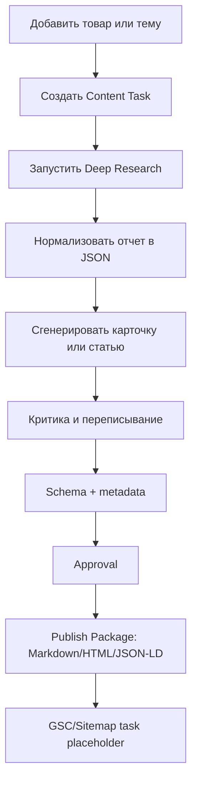

# План работ: оценка архитектуры и очередь задач разработки

## 1. Цель документа

Сформировать практический план разработки продукта на основе двух ТЗ:

- `TZ_AI_content_agent.md` — продуктовое ТЗ;
- `TECH_TZ_PRODUCT_ARCHITECTURE.md` — технологическое ТЗ и архитектура.

Документ нужен для перехода от архитектуры к реализации: определить, что строить первым, какие зависимости есть между модулями, какие задачи входят в MVP, какие риски нужно закрыть до разработки дорогих частей вроде Veo и автоматической публикации.

## 2. Краткая оценка архитектуры

### 2.1. Сильные стороны

Архитектура выбрана правильно для заявленной цели:

- Google-first подход логичен, потому что продукт завязан на Deep Research, Gemini, Veo, Search Console, GA4 и Merchant Center.
- Event-driven pipeline нужен, потому что Deep Research, видео и апрувы являются долгими задачами.
- Разделение на agents и skills уменьшает хаос в prompt-логике.
- Skills registry позволяет развивать систему как платформу, а не набор разрозненных scripts.
- Сохранение всех шагов в БД дает восстановление после сбоев.
- Ручной approval защищает от публикации ошибок на коммерческом сайте.

### 2.2. Главный архитектурный риск

Главный риск — попытаться сразу построить все: Deep Research, статьи, карточки, CMS, Veo, shorts, email, GEO, Merchant Center и мониторинг AI-инструментов.

Правильная стратегия:

1. Сначала построить **task engine + data model + agents foundation**.
2. Потом подключить **Deep Research + Gemini text**.
3. Потом сделать **approval + publish package**.
4. Потом добавить **CMS/GSC**.
5. Потом добавить **Veo/video pipeline**.
6. Потом масштабировать до GEO, email, programmatic SEO и AI tools monitor.

### 2.3. Что нельзя делать на старте

На старте не нужно:

- сразу писать полноценный UI со всеми экранами;
- сразу делать production Google Cloud;
- сразу подключать Veo к боевому pipeline;
- сразу публиковать на сайт без approval;
- сразу строить Temporal;
- сразу делать все агенты;
- сразу делать полный Merchant Center sync.

MVP должен доказать главный workflow: **товар или тема → исследование → контент → проверка → апрув → publish package**.

## 3. Целевая MVP-цепочка

MVP должен закрыть один рабочий контур:



Результат MVP:

- система создает качественный контент;
- хранит источники;
- отличает факты от гипотез;
- отправляет на апрув;
- готовит пакет для публикации;
- не зависит от ручного копирования между чатами.

## 4. Приоритеты разработки

Приоритеты:

| Приоритет | Что строим | Почему |
|----------|------------|--------|
| P0 | фундамент: БД, task engine, adapters, prompt registry | без этого нельзя устойчиво запускать agents |
| P1 | Deep Research + Gemini контент | главная ценность продукта |
| P1 | approval и publish package | безопасность и завершение цикла |
| P2 | CMS/GSC integration | после стабильного контента |
| P2 | skills registry | нужно для качества и масштабирования |
| P3 | Veo/video/shorts | дорого, нужно после approval и media storage |
| P3 | GEO/email/social plans | после research foundation |
| P4 | BigQuery/analytics/AI tools monitor | масштабирование |

## 5. Эпики работ

### Epic 0. Подготовка репозитория

Цель: создать основу проекта.

Задачи:

- создать Git-репозиторий проекта;
- определить структуру backend/frontend/workers;
- добавить `.env.example`;
- добавить `docker-compose.yml`;
- добавить README;
- добавить базовые правила разработки;
- добавить директорию `.agents`;
- подключить `marketingskills` как submodule или vendor folder;
- создать начальный `.agents/product-marketing-context.md`.

Результат:

- репозиторий можно запустить локально;
- есть понятная структура папок;
- secrets не попадают в git.

Оценка: 1-2 дня.

### Epic 1. Backend foundation

Цель: создать API и базовую инфраструктуру данных.

Задачи:

- FastAPI project skeleton;
- конфигурация через Pydantic Settings;
- PostgreSQL connection;
- SQLAlchemy models;
- Alembic migrations;
- healthcheck endpoint;
- error handling;
- structured logging;
- базовая авторизация;
- Dockerfile backend;
- Docker Compose: backend, postgres, redis, minio.

Основные таблицы:

- `products`;
- `content_tasks`;
- `research_reports`;
- `content_versions`;
- `media_assets`;
- `webhook_events`;
- `prompt_templates`;
- `skill_registry`;
- `agent_skill_bindings`;
- `approval_requests`;
- `publication_records`;

Результат:

- backend запускается;
- миграции применяются;
- можно создать товар и задачу.

Оценка: 3-5 дней.

### Epic 2. Task engine и state machine

Цель: сделать управляемое выполнение pipeline.

Задачи:

- реализовать `ContentTaskService`;
- реализовать статусы task;
- реализовать таблицу task events;
- добавить queue abstraction;
- локально использовать Redis + RQ/Celery;
- реализовать retry;
- реализовать failed/cancelled;
- реализовать ручной restart step;
- логировать переходы статусов.

Минимальный state machine:

```text
draft -> queued -> research_running -> research_completed -> content_generating
-> criticizing -> rewriting -> waiting_approval -> approved -> publishing -> done
```

Результат:

- каждая задача имеет статус;
- pipeline можно возобновить после сбоя;
- ошибки видны в API.

Оценка: 3-5 дней.

### Epic 3. Adapters foundation

Цель: отделить бизнес-логику от конкретных API.

Задачи:

- создать интерфейс `LLMAdapter`;
- создать интерфейс `ResearchAdapter`;
- создать интерфейс `MediaAdapter`;
- создать интерфейс `StorageAdapter`;
- создать интерфейс `CMSAdapter`;
- создать интерфейс `SearchConsoleAdapter`;
- добавить mock adapters для тестов;
- добавить Google adapters stubs.

Результат:

- можно разрабатывать pipeline без реальных платных API;
- провайдера можно заменить.

Оценка: 2-3 дня.

### Epic 4. Prompt и skills registry

Цель: сделать управляемую систему промптов и skills.

Задачи:

- реализовать `prompt_templates`;
- реализовать `skill_registry`;
- реализовать загрузку локальных `.agents/skills/*/SKILL.md`;
- реализовать binding agent -> skills;
- добавить версионирование prompt templates;
- добавить минимальные custom skills:
  - `ecommerce-product-normalization`;
  - `ecommerce-specification-extraction`;
  - `ecommerce-aeo-product-description`;
  - `ecommerce-engineer-review`;
  - `ecommerce-video-brief`;
  - `ecommerce-google-indexing-flow`;
- добавить импорт/ссылку на `marketingskills`.

Результат:

- agents работают не на случайных prompts, а на версионированных skills;
- можно видеть, какой skill дал какой результат.

Оценка: 3-5 дней.

### Epic 5. Product Intake

Цель: создать входную точку для товара или темы.

Задачи:

- API создания товара;
- загрузка фото;
- нормализация brand/model/category/sku;
- проверка обязательных полей;
- первичная валидация GTIN/MPN, если есть;
- создание content task из товара;
- создание content task из темы без товара.

Результат:

- пользователь может добавить товар;
- можно запустить pipeline по товару.

Оценка: 2-4 дня.

### Epic 6. Deep Research integration

Цель: подключить исследовательское ядро.

Задачи:

- реализовать Gemini Deep Research adapter;
- поддержать `deep-research-preview-04-2026`;
- поддержать `deep-research-max-preview-04-2026`;
- запуск с `background=true`;
- хранение `interaction_id`;
- polling результата;
- streaming как optional;
- хранение `last_event_id`;
- сохранение raw report;
- сохранение sources;
- нормализация отчета через Formatter Agent;
- режим mock для разработки без API.

MVP prompt types:

- research product specs;
- research competitors;
- research SEO article topic;
- research AI Overview/GEO later as P2.

Результат:

- система получает исследовательский отчет и сохраняет его в БД.

Оценка: 5-8 дней.

### Epic 7. Gemini content generation

Цель: генерировать карточку или статью из research report.

Задачи:

- Gemini text adapter;
- JSON-normalization prompt;
- карточка товара;
- SEO/AEO статья;
- engineer review block;
- designer review block;
- marketing review block;
- FAQ;
- meta title/meta description;
- internal links placeholder;
- language support: RU/UA.

Результат:

- из товара и research report создается draft.

Оценка: 5-7 дней.

### Epic 8. Critic, Rewriter, Quality Gates

Цель: не выпускать сырой AI-текст.

Задачи:

- Critic Agent;
- Rewriter Agent;
- AEO answer-block checker;
- source/fact checker;
- hypothesis checker;
- banned phrase checker;
- completeness checker;
- quality score;
- сохранение замечаний.

Результат:

- каждый draft проходит критику;
- система создает улучшенную версию;
- видны причины доработки.

Оценка: 4-6 дней.

### Epic 9. Schema и publish package

Цель: подготовить результат к публикации.

Задачи:

- Schema Agent;
- Product JSON-LD;
- Article/FAQ/HowTo JSON-LD;
- Markdown export;
- HTML export;
- publication package;
- validation JSON;
- сохранение версии `approved`.

Результат:

- пользователь получает готовый пакет: текст + HTML + schema + meta.

Оценка: 3-5 дней.

### Epic 10. Approval

Цель: добавить безопасный ручной контроль.

Задачи:

- approval request model;
- approval API;
- UI approval screen;
- Telegram bot optional;
- approve/reject/request changes;
- comment parsing;
- возврат в rewrite step;
- audit log.

Результат:

- без approval публикация невозможна.

Оценка: 3-6 дней.

### Epic 11. Minimal UI

Цель: сделать рабочий интерфейс для MVP.

Экраны:

- Dashboard;
- Products;
- Create Product;
- Task Detail;
- Research Report;
- Content Editor;
- Approval Queue;
- Settings.

Результат:

- продукт можно использовать без ручных API-запросов.

Оценка: 7-12 дней.

### Epic 12. CMS и GSC integration

Цель: закрыть публикацию и SEO-контур.

Задачи:

- выбрать первую CMS;
- реализовать CMS adapter;
- publish article/card;
- update existing page;
- sitemap update;
- Search Console URL inspection;
- indexing flow с учетом ограничений Google Indexing API;
- publication record.

Результат:

- approved content можно публиковать или экспортировать в CMS.

Оценка: 5-10 дней, зависит от CMS.

### Epic 13. Media foundation

Цель: подготовить основу для изображений и видео.

Задачи:

- storage для media assets;
- upload/download media;
- thumbnails;
- media metadata;
- media status;
- image brief;
- alt text generation;
- media approval.

Результат:

- система умеет хранить и управлять медиа.

Оценка: 4-6 дней.

### Epic 14. Veo video pipeline

Цель: добавить длинные видео и shorts после стабилизации контентного ядра.

Задачи:

- `Marketing Video Brief`;
- Scriptwriter Agent;
- Storyboard Agent;
- Scene Prompt Agent;
- Veo adapter;
- operation tracking;
- polling;
- download generated clips;
- ffmpeg assembly;
- subtitles;
- export 16:9;
- export 9:16;
- approval.

Результат:

- из маркетингового ТЗ можно получить video package.

Оценка: 10-20 дней.

### Epic 15. GEO, email, social plans

Цель: расширить маркетинговый контур.

Задачи:

- AI Overviews/GEO audit;
- monthly email plan;
- YouTube/Telegram content plan;
- programmatic SEO templates;
- comparison pages;
- llms.txt;
- pricing.md, если применимо;
- Merchant Center field checks.

Результат:

- система становится маркетинговым исследовательским центром, а не только генератором карточек.

Оценка: 10-15 дней.

## 6. Очередь работ по спринтам

### Sprint 0. Проектирование и подготовка

Длительность: 2-3 дня.

Задачи:

- подтвердить MVP scope;
- выбрать первую CMS;
- определить Google Cloud аккаунт и доступы;
- определить язык интерфейса;
- определить формат товара;
- создать репозиторий;
- создать `.agents/product-marketing-context.md`;
- создать initial backlog.

Выход:

- команда понимает, что именно строится в MVP.

### Sprint 1. Backend и БД

Длительность: 1 неделя.

Задачи:

- FastAPI skeleton;
- PostgreSQL;
- migrations;
- models;
- products API;
- tasks API;
- healthcheck;
- logging;
- Docker Compose.

Выход:

- можно создать товар и task.

### Sprint 2. Task engine и adapters

Длительность: 1 неделя.

Задачи:

- state machine;
- queue;
- workers;
- adapters interfaces;
- mock adapters;
- prompt registry minimal;
- skill registry minimal.

Выход:

- можно запускать mock pipeline.

### Sprint 3. Deep Research MVP

Длительность: 1-2 недели.

Задачи:

- Deep Research adapter;
- mock mode;
- real API mode;
- polling;
- save report;
- normalize report;
- research report UI/API.

Выход:

- система делает и хранит исследование.

### Sprint 4. Content generation MVP

Длительность: 1-2 недели.

Задачи:

- Gemini adapter;
- product card generator;
- article generator;
- engineer/marketing review blocks;
- FAQ;
- meta fields;
- content versions.

Выход:

- система создает draft.

### Sprint 5. Critic, rewrite, schema

Длительность: 1 неделя.

Задачи:

- Critic Agent;
- Rewriter Agent;
- quality gates;
- JSON-LD generation;
- Markdown/HTML export.

Выход:

- draft превращается в publish package.

### Sprint 6. Approval и UI MVP

Длительность: 1-2 недели.

Задачи:

- approval model;
- approval API;
- task detail UI;
- editor UI;
- approval queue;
- request changes flow.

Выход:

- владелец может проверить и принять результат.

### Sprint 7. CMS/GSC integration

Длительность: 1-2 недели.

Задачи:

- CMS adapter;
- publish endpoint;
- publication record;
- sitemap/GSC task;
- indexing report placeholder.

Выход:

- контент выходит из системы в сайт или готовый экспорт.

### Sprint 8. Media foundation

Длительность: 1 неделя.

Задачи:

- media storage;
- image brief;
- image generation optional;
- alt text;
- media approval.

Выход:

- система готова к video pipeline.

### Sprint 9. Veo / Shorts pilot

Длительность: 2-3 недели.

Задачи:

- video brief;
- storyboard;
- scene prompts;
- Veo adapter;
- operation tracking;
- ffmpeg assembly;
- subtitles;
- shorts export.

Выход:

- пилотный ролик и shorts по маркетинговому ТЗ.

## 7. Первые задачи в backlog

### P0-001. Создать репозиторий и структуру проекта

Описание:

Создать базовую структуру monorepo.

Acceptance criteria:

- есть `backend/`;
- есть `frontend/`;
- есть `workers/`;
- есть `.agents/`;
- есть `docker-compose.yml`;
- есть `.env.example`;
- есть README.

### P0-002. Создать FastAPI backend

Acceptance criteria:

- запускается локально;
- есть `/health`;
- есть конфиг окружения;
- есть structured logging.

### P0-003. Подключить PostgreSQL и Alembic

Acceptance criteria:

- миграции работают;
- создана первая миграция;
- модели импортируются.

### P0-004. Реализовать Products API

Acceptance criteria:

- `POST /api/products`;
- `GET /api/products`;
- `GET /api/products/{id}`;
- `PATCH /api/products/{id}`.

### P0-005. Реализовать Content Tasks API

Acceptance criteria:

- `POST /api/tasks`;
- `GET /api/tasks`;
- `GET /api/tasks/{id}`;
- статусы сохраняются.

### P0-006. Реализовать task state machine

Acceptance criteria:

- есть допустимые переходы;
- недопустимые переходы отклоняются;
- каждый переход логируется.

### P0-007. Реализовать queue worker

Acceptance criteria:

- task можно поставить в очередь;
- worker меняет статус;
- ошибка переводит task в failed.

### P0-008. Реализовать adapter interfaces

Acceptance criteria:

- `ResearchAdapter`;
- `LLMAdapter`;
- `StorageAdapter`;
- `CMSAdapter`;
- `MediaAdapter`;
- mock implementations.

### P0-009. Реализовать prompt registry

Acceptance criteria:

- prompt templates хранятся в БД;
- есть версия prompt;
- task сохраняет prompt version.

### P0-010. Реализовать skill registry

Acceptance criteria:

- skills можно загрузить из `.agents/skills`;
- есть `skill_registry`;
- есть `agent_skill_bindings`.

## 8. Архитектурные решения, которые нужно принять до кода

### ADR-001. Где запускать MVP

Варианты:

- локально через Docker Compose;
- сразу Cloud Run.

Рекомендация:

Начать локально через Docker Compose, но писать с совместимостью под Cloud Run.

### ADR-002. Какая первая CMS

Нужно выбрать первую интеграцию:

- Prom.ua;
- Хорошоп;
- WordPress;
- OpenCart;
- кастомная CMS;
- временный Markdown/HTML export.

Рекомендация:

Если API CMS не готов, MVP должен завершаться publish package. CMS integration делать следующей фазой.

### ADR-003. Очереди

Варианты:

- Redis + RQ;
- Redis + Celery;
- Google Pub/Sub + Cloud Tasks;
- Temporal.

Рекомендация:

MVP: Redis + RQ или Celery. Production: Pub/Sub/Cloud Tasks или Temporal после стабилизации.

### ADR-004. Где хранить skills

Варианты:

- только в БД;
- только в файлах;
- hybrid.

Рекомендация:

Hybrid: исходник в `.agents/skills/*/SKILL.md`, индекс и metadata в БД.

### ADR-005. Когда подключать Veo

Рекомендация:

Veo подключать после готового approval и media storage. Иначе дорого тестировать и трудно контролировать качество.

## 9. Риски запуска

| Риск | Вероятность | Влияние | Митигировать |
|-----|-------------|---------|--------------|
| API Google меняется | средняя | высокое | adapters, feature flags, mock mode |
| Deep Research дорогой | средняя | среднее | budget limits, Standard vs Max, caching |
| Veo дорого тестировать | высокая | среднее | approval brief до генерации |
| CMS API сложный | высокая | среднее | publish package как fallback |
| AI галлюцинирует характеристики | высокая | высокое | source/confidence/hypothesis fields |
| Переусложнение MVP | высокая | высокое | жесткий MVP scope |
| Нет product marketing context | средняя | среднее | создать контекст в Sprint 0 |

## 10. Definition of Done для MVP

MVP готов, если:

- можно добавить товар;
- можно создать content task;
- task проходит state machine;
- Deep Research или mock research создает report;
- Gemini или mock LLM создает draft;
- Critic/Rewriter создает улучшенную версию;
- Schema Agent создает JSON-LD;
- есть approval;
- есть publish package;
- все версии сохраняются;
- ошибки видны;
- можно повторить шаг;
- secrets не логируются;
- есть README запуска.

## 11. Рекомендуемый порядок прямо сейчас

1. Утвердить MVP scope.
2. Выбрать первую CMS или оставить publish package.
3. Создать репозиторий проекта.
4. Создать `.agents/product-marketing-context.md`.
5. Создать skeleton backend.
6. Создать БД и migrations.
7. Реализовать products/tasks.
8. Реализовать task engine.
9. Реализовать adapters.
10. Подключить mock pipeline.
11. Потом подключать реальные Google API.

## 12. Связанные документы

- `TZ_AI_content_agent.md`;
- `TECH_TZ_PRODUCT_ARCHITECTURE.md`;
- `super_prompt_aeo.md`;
- `ai_strict_prompt_tz.md`;
- `ТЗ_Агент_мониторинга_AI-1.md`;
- `TZ_Deep_Research_v2.docx`;
- `https://github.com/Sevrikov/marketingskills`.
