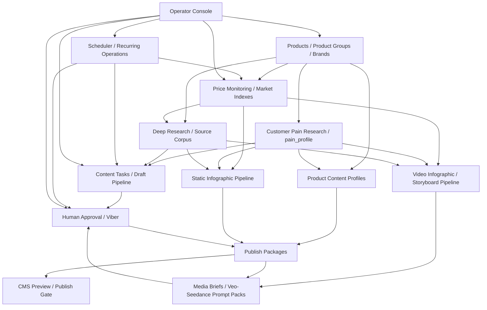

# Program Map & API Keys

## Зачем нужна эта карта

Перед дальнейшим развитием стоит зафиксировать карту продукта. У нас уже есть несколько крупных линий: контент, исследование, карточки товаров, цены, инфографика, видео, Viber, CMS, scheduler и будущие pain profiles. Без общей схемы тестирование начнет путаться: непонятно, какой модуль проверять первым, какие данные нужны и где нужны реальные API-ключи.

Этот документ отвечает на три вопроса:

1. Из каких модулей состоит программа.
2. Как данные проходят между модулями.
3. Какие ключи/API нужны для локального теста, расширенного теста и production.

## Главная карта продукта



## Модули и статус

| Модуль | Назначение | Текущий статус | Следующий шаг |
|---|---|---:|---|
| Products | База товаров, брендов, категорий, цен, исходных описаний | Реализовано | Импорт/обновление из источников |
| Content Tasks | Очередь задач: карточки, статьи, research, video brief | Реализовано | Подключить pain profile как вход |
| Research | Mock/Gemini research + source corpus | Реализовано | Query planner и dedupe |
| Source Provider | Mock/Tavily слой для корпуса источников | Реализовано частично | Serper/DataForSEO/Brave/Firecrawl adapters при необходимости |
| Customer Pain Research | Исследование боли, proof map, objections | Архитектура/skill | `pain_profiles` backend |
| Draft Pipeline | Initial draft -> critic -> rewrite -> approval | Реализовано | Pain-aware QA gates |
| Product Content Profiles | Структурные карточки товара для CMS/schema.org | Реализовано | Обновление по расписанию |
| Price Monitoring | Проверка известных URL, snapshots, trends | Реализовано | Масштабирование источников и stock sync |
| Market Intelligence | Индексы цен и тренды по группам товаров | Реализовано | Больше правил значимости |
| Notification Policies | Массовые тренды, digest, immediate alerts | Реализовано | Viber production onboarding |
| Scheduler | Единый движок регулярных операций | Реализовано | Исполнители для stock/price sync |
| Content Opportunities | Темы статей по товару/группе/бренду | Реализовано | Deep research query planner |
| Static Infographics | Data pack, design brief, browser design prompts | Архитектура/skill | Backend models/API |
| Video Infographics | Script, storyboard, Veo/Seedance prompt packs | Архитектура/skill | Backend storyboard models/API |
| Media Briefs | Video brief pack для approved package | Реализовано | Approval перед real generation |
| Viber | Уведомления и approval через Viber | Реализовано частично | Реальный бот + webhook |
| CMS Publishing | Preview + safety gate | Реализовано mock | Выбрать CMS и сделать adapter |
| Operator Console | Локальный интерфейс управления | Реализовано частично | Вкладки Pain/Infographics/Video Infographics |

## Data flow по ключевым материалам

### Описание товара

```text
Product
-> Customer Pain Research
-> Deep Research / Source Corpus
-> Product Content Profile
-> Content Task Draft
-> Critic / Pain QA
-> Approval
-> Publish Package
-> CMS Preview
```

### SEO/AEO статья

```text
Product / Group / Brand / Topic
-> Content Opportunity
-> Customer Pain Research
-> Deep Research
-> Draft Pipeline
-> Critic / Rewrite
-> Approval
-> Publish Package
-> CMS Preview
```

### Статическая инфографика

```text
Product / Group / Trend
-> Customer Pain Research
-> Infographic Data Pack
-> Market Analysis
-> Design Brief
-> Browser Design Prompt
-> Asset QA
-> Approval
-> CMS / Social / Viber Export
```

### Видео-инфографика и Shorts

```text
Product / Group / Trend
-> Customer Pain Research
-> Infographic Data Pack
-> Video Data Summary
-> Script Brief
-> Storyboard JSON
-> Veo / Seedance / Manual Editor Prompt Pack
-> Clip Generation or Manual Design
-> Assembly / Overlays / Subtitles
-> Video QA
-> Approval
-> Publication Pack
```

## Тестовые фазы

### Phase 0: Local mock test

Цель: проверить бизнес-логику без внешних денег и ключей.

Нужны ключи: нет.

Настройки:

```text
LLM_PROVIDER=mock
RESEARCH_PROVIDER=mock
SOURCE_PROVIDER=mock
NOTIFICATION_PROVIDER=mock
CMS_PROVIDER=mock
PRICE_MONITOR_PROVIDER=mock
ENABLE_REAL_PUBLISHING=false
ENABLE_REAL_VIDEO_GENERATION=false
```

Что тестируем:

- products;
- content tasks;
- draft pipeline;
- approvals;
- publish packages;
- CMS preview;
- scheduler;
- market mock flows;
- media brief generation.

### Phase 1: Google/Gemini smoke

Цель: проверить реальные Gemini вызовы на малом объеме.

Нужны ключи:

- `GOOGLE_API_KEY`.

Настройки:

```text
RESEARCH_PROVIDER=gemini
LLM_PROVIDER=gemini
GOOGLE_API_KEY=...
ENABLE_GOOGLE_SMOKE_TESTS=true
GEMINI_CONTENT_MODEL=gemini-2.5-flash-lite
GEMINI_CRITIC_MODEL=gemini-2.5-flash-lite
GEMINI_RESEARCH_MODEL=gemini-2.5-flash-lite
```

Важно:

- держать `ENABLE_GEMINI_QUOTA_GOVERNOR=true`;
- не использовать exhausted models;
- начинать с smoke scripts, а не с массовой генерации.

### Phase 2: Real source collection

Цель: проверить сбор корпуса источников для deep research, pain research, статей и инфографики.

Нужны ключи:

- `TAVILY_API_KEY` для текущего реализованного Tavily provider.

Опциональные будущие ключи:

- Serper API key для дешевого Google SERP;
- DataForSEO credentials для массового SERP;
- Brave Search API key;
- Firecrawl API key для scraping/extraction;
- SerpApi key, если понадобится дорогой fallback.

Настройки:

```text
SOURCE_PROVIDER=tavily
TAVILY_API_KEY=
SOURCE_COLLECTION_ENABLED=true
SOURCE_COLLECTION_MAX_RESULTS=5
TAVILY_SEARCH_DEPTH=basic
TAVILY_INCLUDE_RAW_CONTENT=markdown
```

### Phase 3: Price and market monitoring

Цель: проверять известные URL товаров/конкурентов и строить рыночные индексы.

Нужны ключи: нет для mock/browser tests.

Настройки:

```text
PRICE_MONITOR_PROVIDER=mock
```

Для browser/JS проверки:

```text
PRICE_MONITOR_PROVIDER=playwright
```

Нужно:

- установленный Playwright runtime;
- аккуратные лимиты;
- user agent;
- список известных URL.

### Phase 4: Viber approval bot

Цель: реальная отправка уведомлений маркетологу/оператору.

Нужны ключи/данные:

- `VIBER_AUTH_TOKEN`;
- `VIBER_REVIEWER_IDS`;
- публичный HTTPS URL для webhook;
- возможно Cloudflare Tunnel, ngrok или production domain.

Настройки:

```text
NOTIFICATION_PROVIDER=viber
VIBER_AUTH_TOKEN=
VIBER_REVIEWER_IDS=
VIBER_WEBHOOK_PUBLIC_URL=https://.../api/webhooks/viber
VIBER_WEBHOOK_SECRET_REQUIRED=true
```

Важно:

- Viber может писать только пользователям, которые подписались на бота или начали диалог;
- сначала проверять webhook payload builder;
- реальную установку webhook делать только явной командой.

### Phase 5: CMS integration

Цель: публиковать approved content в реальную CMS.

Текущий статус: есть mock CMS preview и publish safety gate, реального CMS adapter пока нет.

Будущие ключи зависят от выбранной CMS:

- WordPress/WooCommerce: site URL, application password/API token, user;
- Хорошоп/Prom/Shopify/другая CMS: API token, store id/domain, product/category ids;
- custom CMS: base URL, token, destination type.

Настройки будут расширены после выбора CMS:

```text
CMS_PROVIDER=...
CMS_DESTINATION_TYPE=...
ENABLE_REAL_PUBLISHING=false
```

Реальный publish включать только после:

```text
ENABLE_REAL_PUBLISHING=true
confirmation_phrase=publish:{preview_id}
```

### Phase 6: Real video generation

Цель: запуск реальной генерации Veo/Seedance после утвержденных storyboard и prompt packs.

Текущий статус: реальная генерация отключена, есть media/video prompt packs.

Потенциальные ключи:

- `GOOGLE_API_KEY` для Gemini API / Veo, если у проекта есть ненулевые лимиты;
- Google Cloud project/location credentials for Vertex AI, если перейдем на Vertex AI;
- Seedance/ByteDance provider API key, если подключаем через официальный или aggregator API;
- storage credentials для сохранения видео.

Настройки:

```text
ENABLE_REAL_VIDEO_GENERATION=false
```

Реальный запуск только после:

- provider profile проверен;
- лимиты подтверждены;
- storyboard approved;
- prompt pack approved;
- бюджет установлен;
- generation job logging готов.

### Phase 7: Observability

Цель: видеть стоимость, ошибки, качество, latency.

Опциональные ключи:

- `LANGFUSE_PUBLIC_KEY`;
- `LANGFUSE_SECRET_KEY`;
- `LANGFUSE_HOST`.

Пока не критично для MVP, но желательно перед длинными Gemini/Tavily прогонками.

## Минимальный набор ключей для следующего тестирования

### Достаточно для ближайшего dev/test

1. Никаких ключей для local mock.
2. `GOOGLE_API_KEY` для ограниченного Gemini smoke.
3. `TAVILY_API_KEY` для реального source corpus.

### Для теста approval в мессенджере

4. `VIBER_AUTH_TOKEN`.
5. `VIBER_REVIEWER_IDS`.
6. Публичный HTTPS webhook URL.

### Для будущего production

7. CMS API credentials.
8. Production DB credentials.
9. Production Redis credentials.
10. Object storage credentials.
11. Observability keys.
12. Video provider credentials only after approval gate.

## Что не нужно прямо сейчас

- Real CMS token, пока не выбран CMS destination.
- Real video generation key, пока нет storyboard approval workflow.
- Telegram token, потому что фокус на Viber.
- DataForSEO/Serper/Brave, пока Tavily достаточно для первого source corpus теста.
- Cloud storage keys, пока локальный MinIO/mock достаточно.

## Рекомендуемый порядок дальнейшей работы

1. Зафиксировать эту карту как baseline.
2. Реализовать `P0-044`: `pain_profiles` backend.
3. Реализовать `P0-040`: infographic projects/data packs.
4. Реализовать `P0-042`: video infographic projects/storyboards.
5. Добавить вкладки Operator Console: Pain, Infographics, Video Infographics.
6. Прогнать local mock E2E.
7. Подключить `GOOGLE_API_KEY` и сделать короткий Gemini smoke.
8. Подключить `TAVILY_API_KEY` и сделать 1-2 реальных research run.
9. Только после этого подключать Viber production webhook.

## Контроль безопасности

- Все ключи только в `.env`, никогда в docs, README, screenshots, prompts или Git.
- Любой ключ, который попал в чат или лог, нужно считать скомпрометированным и заменить.
- Реальная публикация и генерация видео остаются выключенными по умолчанию.
- Все дорогие операции должны иметь явный флаг, бюджетный лимит и event log.
## Runtime API Settings Manager

Implemented operator settings layer:

- `GET /api/runtime-settings`;
- `PUT /api/runtime-settings`;
- frontend tab `API settings`;
- sections: `Secrets`, `Providers`, `Models`, `Safety`, `Viber`;
- Google/Tavily/Viber secrets are write-only: UI returns only configured/masked state;
- empty secret fields do not clear stored values;
- runtime overrides are applied to worker content/research adapters, opportunity discovery, image generation, CMS preview and Viber notifications.

Recommended workflow:

1. Add Google/Tavily/Viber keys in `API settings`.
2. Select providers: `mock`, `gemini`, `tavily`, `viber`.
3. Select task models for content, critic/rewrite, deep research and image generation.
4. Enable real calls only through the matching safety flags.
